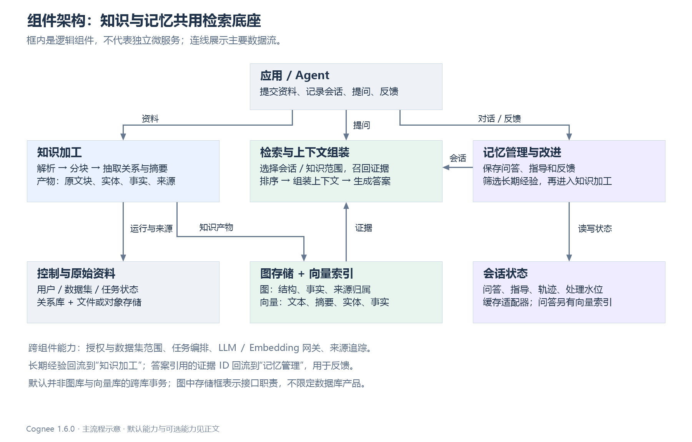
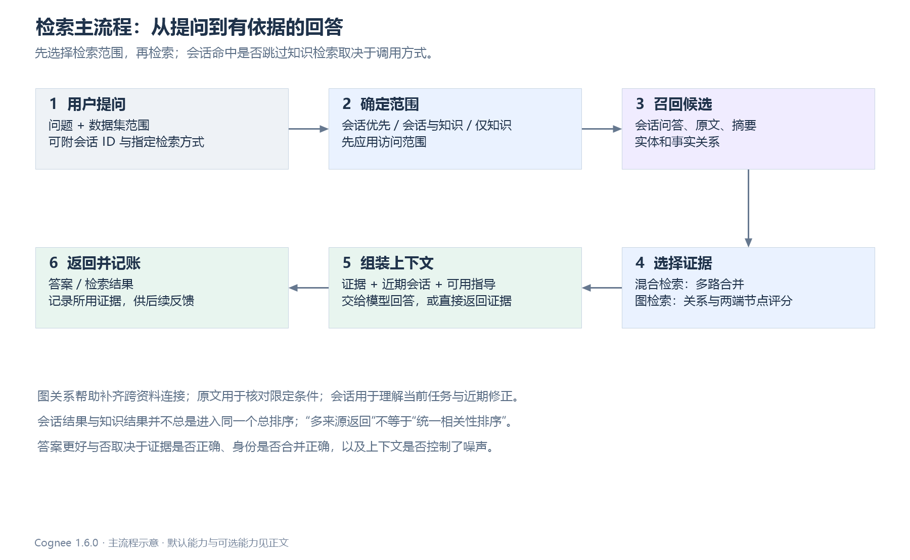

# Cognee 技术架构：面向复刻的组件与主流程

调研日期：2026-09-21。源码基线：官方仓库 `topoteretes/cognee`，版本 **1.6.0**，固定提交 **`663a2dc15d04bc0d7ec2733a2dd604b7ed1b8c8e`**。本文依据该提交的静态源码分析；未运行完整 Cognee 服务，也未进行竞品性能实测。版本信息见 [pyproject.toml][S0]。

本文回答“系统由什么组成、组件如何交互、复刻需要哪些边界”。算法、数据结构、数值算例、异常处理和竞品比较见 [技术细节与方案对比](Cognee_技术细节与方案对比.md)。图仅展示组件与体验主流程，具体函数和源码依据留在正文及引用中。

**核心判断：Cognee 是把资料加工、图与向量检索、会话状态、反馈和长期经验提炼串起来的记忆系统。** 它值得复刻的部分是这些能力之间的数据契约和闭环；只复制“文本 → 实体关系 → 向量库”不能复刻它的行为。同时，它并不天然保证跨库一致性、实体识别正确性或比所有竞品更好的答案质量。

文中的“源码行为”指固定提交可核实的实现；“可选能力”受配置、模型或后端能力限制；“复刻建议”是给本项目的设计建议，不是 Cognee 已实现的承诺。

## 1. 先区分知识、经历和长期记忆

| 对象 | 存什么 | 什么时候产生 | 后续如何使用 |
| --- | --- | --- | --- |
| 原始资料 | 文件、文本、来源及导入元数据 | 用户导入 | 重新解析、版本核查、证明派生知识的依据 |
| 知识图与语义索引 | 文档、原文块、摘要、实体、关系及向量 | 资料加工完成后 | 找原文、连关系、组合多份资料的证据 |
| 会话经历 | 问题、答案、使用的证据 ID、反馈、执行轨迹 | 每次交互或显式记录 | 恢复当前任务上下文、解释历史行为、提取经验 |
| 会话指导 | 目标、规则、偏好、经验，以及工具使用等指导 | 会话分析或执行轨迹分析 | 在后续回答中约束行为；经过筛选才能参与长期提炼 |
| 长期经验 | 从经历中提炼出的可复用陈述及原因 | 改进阶段的蒸馏发布 | 作为文档再次入库建图，使后续会话能够检索 |
| 反馈权重 | 曾被使用的节点、边的帮助程度 | 对历史回答的反馈被处理后 | 在检索策略启用反馈影响时改变排序 |

这些对象不是同一张“memory 表”的不同标签。它们的身份、生命周期和失败语义不同。例如，会话缓存保存成功，不代表长期经验已入知识库；已经归档问答，也不代表从中提炼出了可靠经验。[会话管理][S9]、[改进阶段][S11]、[长期经验提炼][S12]

## 2. 组件架构与交互



图中的组件是逻辑边界。使用 Python SDK 时，大量组件在同一进程中运行；部署 API 服务不自动把它们变成独立微服务。图、向量、关系数据库及模型服务可以在进程外，也可以使用本地适配器。复刻时应先保持这些逻辑边界，再根据吞吐和运维需要决定进程划分。

### 2.1 各组件到底负责什么

| 组件 | 接收什么 | 做什么、交给谁 | 持久状态与失败边界 |
| --- | --- | --- | --- |
| 公共 API / SDK | 数据、问题、用户、数据集和会话范围 | 提供 `add / cognify / remember / recall / improve` 等入口，组织工作流 | “请求已接受”和“知识可检索”必须区分；后台任务尚未完成时不能假定已入库 |
| 身份与范围解析 | 用户和数据集名称或 ID | 解析授权范围，再设置后续操作使用的数据集上下文 | 范围决定访问边界；业务标签 NodeSet 不能替代授权 |
| Pipeline 编排 | 任务列表、数据项、配置 | 记录运行状态，按数据集协调写入，控制并发与批次，失败时触发回滚处理 | 存运行状态与逐数据项进度；当前数据集锁只在单进程内生效 |
| 解析与分块 | 原始 Data 及解析配置 | 转成 Document，再产生带文档归属的 Chunk | 解析/分块变化会影响下游身份、重复处理和引用；需要记录算法版本 |
| 知识加工 | 文本块、图模型、可选本体 | 抽取实体与关系，并生成摘要；构造成相互引用的 DataPoint | 模型输出需验证；抽取错误不能由存储层自动纠正 |
| LLM / Embedding 网关 | 提示词、结构化输出约束、待嵌入文本 | 调用外部或本地模型，为抽取、提炼和检索提供结果 | 请求失败、限流、维度变化都要暴露给任务；LLM 与 Embedding 是不同依赖 |
| 图与向量存储适配 | 节点、边、来源归属、语义文本 | 写结构，按对象字段创建向量索引；为查询提供图邻域与向量候选 | 普通路径有写入顺序约束，但没有统一跨库事务 |
| 检索器 | 问题、范围、策略与参数 | 召回候选、补图关系、排序、形成可读证据 | 不同策略的分数含义不同；需要分别记录各路候选和过滤结果 |
| 上下文与答案生成 | 证据、历史、指导、问题 | 组装提示词、生成答案、返回或记录使用的证据 | 证据不足与模型生成错误需分开诊断；来源 ID 不应在拼提示词时丢失 |
| SessionManager | 问答、反馈、轨迹、指导 | 保存当前经历，准备后续交互上下文，关联实际使用的知识 | 缓存不可用时存在降级路径；保存问答还会尝试建立会话向量索引 |
| Improve 编排 | 会话、数据集、开关与水位 | 更新反馈、持久化问答和轨迹、提炼经验、执行可选增强 | 各阶段独立报告状态；只有问答持久化阶段被定义为致命失败阶段 |

源码落点：[Pipeline 编排][S3]、[知识加工][S4]、[存储协调][S5]、[混合检索][S7]、[会话管理][S9]、[Improve 注册表][S10]。

### 2.2 不应被架构图省略的横向职责

**第一，授权范围必须传到每条检索分支。** 向量候选、邻居扩展、事实文本索引、会话历史都可能成为数据出口。只给入口 API 加权限检查，不等于图扩展和索引读取已经受同样约束。固定版本的 Hybrid 检索专门处理 NodeSet 范围下的邻居与事实过滤，说明范围约束需要贯穿检索内部。[实体扩展][S15]、[事实过滤][S16]

**第二，来源归属与业务关系是两种信息。** “Atlas 由支付团队维护”是业务关系；“这个节点和关系由文档 A 的片段 3 生成”是产物归属。后者决定删除、更新和失败清理能否正确完成。仅有 `chunk → entity` 的图边，不能完全替代来源归属记录。[存储来源处理][S5]

**第三，状态不等于索引。** 问答正文、反馈处理进度、经验蒸馏水位属于状态；用于找相似问答的向量属于索引。复刻时应允许索引重建，不能把索引中“有一行”当作状态已经正确发布的唯一凭证。

## 3. 用户导入资料后发生什么


### 3.1 第一阶段：接收与登记

`add` 接收数据，解析授权数据集、解析输入来源，并执行导入流水线。它负责把输入变成可被后续加工的数据项；**导入成功本身不等同于图谱和语义索引已准备好**。`remember` 的永久记忆路径可以把 `add` 与 `cognify` 组合起来，降低调用方的编排负担。[add][S1]、[remember][S18]

固定版本还会在写入前拒绝某些“已有文档的内容改变却仍以 add 导入”的情况，要求走 `update`。因此，不能把 `add` 描述成无条件自动覆盖旧文件的接口。复刻 API 要明确区分新增、重放和更新，避免留下新旧事实共存却没有版本解释的问题。

### 3.2 第二阶段：加工知识

普通文本的标准加工链为：分类/解析文档 → 文本分块 → 抽取图与生成摘要 → 写入知识产物。记录额外 provenance、矛盾检测、时态冲突处理有各自配置条件；不能画成所有导入都必须执行的步骤。[cognify 标准任务][S2]

在所分析的标准抽取路径中，一个文本块同时产生两类结果：关系图表达“对象之间如何关联”，摘要表达“这段文本主要说了什么”。摘要连接回原文块，原文块连接文档并挂接抽取实体。存储组件遍历这些相互引用的对象，将其展开成节点和边，再建立多类向量索引。[并行加工][S4]、[对象展开][S6]

固定版本也包含无需常规 LLM 的安装和提取器选择，以及 DLT、代码等专用路径。**本文复刻基线是带结构化抽取的普通文本路径**，不声称所有数据类型都经过同一套提示词或同样数量的模型调用。

### 3.3 第三阶段：持久化与可检索性

普通分离存储路径对节点先写图及来源，再写节点向量；对边先写图边及来源，再写边对应的语义索引。这样即使向量写入中途失败，系统仍有线索定位已生成产物。这里的先后约束针对对应产物，不意味着“所有图写完之后才开始任何向量写入”。[add_data_points][S5]

产品层应向用户解释三个状态：资料已接收、正在加工、加工完成可检索。若复刻为异步服务，建议返回稳定的 job ID，并让查询只使用满足发布条件的版本；“上传接口返回 200”不能直接当成全部知识可用。

## 4. 知识在存储中如何组织


### 4.1 一个例子贯穿所有视图

假设导入两份资料：A 说“Atlas 由支付团队维护”，B 说“支付团队隶属于基础平台部”。

在原文视图中，保留 A、B 的原文及片段；在知识图视图中，形成 `Atlas —维护方→ 支付团队 —隶属→ 基础平台部`；在向量视图中，原文、摘要、实体名称、完整事实句各有语义入口。问题“Atlas 的维护团队属于哪个部门”可能需要组合两份资料的关系，但最终仍应能指出 A 和 B 分别提供了什么证据。

这个例子说明图能够表达跨资料连接，但不证明任意默认检索都会自动完成任意深度的多跳推理。候选是否包含中间实体、允许多少邻域、上下文是否保留两条关系，都会影响结果。图存储提供结构条件，检索策略负责取到它们，模型负责基于证据形成回答。

### 4.2 各存储的责任边界

| 存储面 | 主要内容 | 不应承担的职责 |
| --- | --- | --- |
| 关系元数据 | 用户、数据集、原始数据记录、流水线运行等；部分后端还使用关系表记录回滚来源 | 不应只靠任务成功状态推定所有外部索引一致 |
| 文件/对象存储 | 原始输入及可重新读取的资料内容 | 不负责语义排序，也不替代派生知识的版本关系 |
| 图存储 | DataPoint 节点、业务关系、结构关系、权重、来源引用等 | 不应把模型生成的关系当作未经验证的客观真值 |
| 向量存储 | 原文文本、摘要、实体名称、事实句、可选三元组，以及会话问答索引 | 向量相似度不能代表事实真假；共享文本向量也不总是对应唯一图边 |
| 会话状态存储 | 问答、指导、轨迹、反馈和水位 | 不能因为名为 cache 就忽视其中尚未归档的状态；部署需核实适配器持久性与保留策略 |

索引名称通常采用 `类型_字段`，例如 `DocumentChunk_text`、`TextSummary_text`、`Entity_name`。`EdgeType_relationship_name` 名称容易误导：固定版本优先索引完整 `edge_text`，缺失时才退回关系名称。复刻时若只向量化“维护”“属于”这样的谓词，会丢掉事实的具体语义。[节点索引][S19]、[边索引][S20]

### 4.3 稳定身份与共享来源是基础设施

实体通常使用规范化名称生成稳定 ID；块 ID 包含文档 ID、文本内容哈希和相同内容的出现次数。前者有利于跨块汇聚，后者有利于减少位置变化造成的身份漂移。它们不是万能实体消歧和万能文档增量算法。具体碰撞、同名处理和边身份规则见第二篇文档。

同一条业务关系可能被多个块、多个文档支持。存储时可以只保留一份关系对象，但必须保留各个来源的支持。否则，去重成功会变成删除时的错误：删除 A 时错误地删掉仍由 B 支持的知识。

## 5. 用户提问后发生什么



### 5.1 先确定范围，才能讨论检索算法

固定版本 `recall` 的默认自动范围有以下区别，调用参数会改变产品体验：[recall 路由][S8]

| 调用条件：未显式设置 scope | 实际范围行为 | 用户可能感知的结果 |
| --- | --- | --- |
| 有 session ID，无数据集范围，未指定 query_type | 先会话，命中后可跳过图检索 | 快速返回本会话内容，但不一定补充知识库中的更完整资料 |
| 有 session ID、有数据集范围，未指定 query_type | 会话与知识范围都运行并贡献结果 | 可以获得两类结果；并不是统一相关性分数融合 |
| 其他情况，包括显式 query_type | 默认只走 graph 范围 | 选择了知识检索；某些答案生成路径仍可使用会话上下文 |

“graph 范围”是 recall 的来源名称，**不等于只能使用 GRAPH_COMPLETION**。该范围内仍可路由到 CHUNKS 或 HYBRID 等检索类型。显式类型优先；无法使用 LLM 时可以退回 CHUNKS，否则自动路由器选择，未命中规则时使用 Hybrid。

### 5.2 两种核心知识检索机制

**Hybrid** 并行搜索原文块/摘要，以及实体/事实句。摘要命中关联回原文；原文和摘要名次做 RRF 融合。实体候选补充一跳关系，事实候选经去重和范围过滤后形成补充证据，最终组织成“相关段落、实体关系、相关事实”。它适合既要原文限定条件、又要关系连接的问答。[Hybrid 检索器][S7]

**GraphCompletion** 将节点与边的语义距离映射到图，再对一条关系的头节点、边、尾节点联合评分，取综合距离较小的关系作为上下文。重要性、反馈、可选个性化参与评分。它不是“先找到相似实体，然后无条件把全部邻居塞进提示词”。具体公式、缺失惩罚及候选范围见第二篇。[图检索流程][S21]、[图评分][S22]

### 5.3 答案生成与证据记账

检索完成后，把证据与问题、会话历史和合格指导组成模型输入。历史选择不只支持最近窗口：固定版本还会尝试会话向量召回，与近期问答去重后按时间顺序组织。问答向量失败时可以退回近期历史。[会话向量][S13]

回答保存时记录使用的图节点/边 ID，以及使用的会话指导 ID，后续才能把反馈关联到被使用的材料。这里也存在覆盖边界：Hybrid 的某些独立事实候选来自 EdgeType 向量对象，不等于唯一图边；不能假定所有呈现给模型的文本都已经精确对应一条可调权图边。[Hybrid 上下文][S23]

复刻建议把内部结果定义为 `EvidenceBundle`：证据项、来源、访问范围、检索路径、分数含义、实际使用的图对象 ID，以及 token 成本。即使外部只返回文本，也保留这个结构以支持解释、反馈、删除和评测。

## 6. 记忆如何从会话进入长期知识


### 6.1 写入会话不是简单的永久入库

带会话的记录会保存问答经历；SessionManager 在缓存写入后还会尝试建立 `SessionQAVector_text` 索引，失败时记录日志并继续。因此，“会话路径完全没有 Embedding 开销”不符合此版本源码。[SessionManager][S9]、[会话向量][S13]

会话回答阶段可以分析用户的反馈和候选指导；指导涵盖目标、规则、偏好、经验，以及工具规则、流程状态等。**用于当前回答的指导门槛，与用于长期蒸馏的门槛并不完全相同**，不能用一个全局布尔值概括“是否可信”。第二篇说明具体过滤条件。

### 6.2 Improve 是有顺序、有门槛的改进流水线

固定版本注册九个阶段：反馈调权 → 问答持久化 → 轨迹持久化 → 轨迹提炼指导 → 会话经验蒸馏 → 用户偏好更新 → truth subspace → 三元组增强 → 全局上下文索引。各阶段先检查会话、配置、后端和模型条件，可能完成、跳过、已完成或报错；不是每次调用九步都产生新知识。[注册表][S10]、[阶段实现][S11]

问答持久化失败会终止流程；其他阶段出错可被记录后继续后续阶段。因此，API 的整体运行结果不能替代逐阶段检查。复刻管理界面应能展示“问答已归档，经验提炼失败，后续可重试”这一类部分完成状态。

自动改进受开关和阈值控制。条数阈值或时间阈值满足时触发，但时间判断发生在写入调用时，不是独立定时器。降低触发频率会减少重复加工成本，也会增加知识更新延迟；会话在阈值前结束时应由应用显式 flush/improve。[自动触发门槛][S14]

### 6.3 长期经验使用与知识库相同的发布路径

经验蒸馏从合格指导和问答时间线提案，查询相似旧经验与实体名称，由第二次模型判断是否新颖、持久、有依据。被接受的经验写成文档，调用 add/cognify 入库；不递归调用 remember/improve。这样，长期记忆进入同一套原文、图、向量和来源管理，而不是另建一个无法治理的“经验黑箱”。[蒸馏实现][S12]

代价是额外模型调用、写入延迟和新派生内容。经验可能被错误概括；重试也可能产生语义相同但字节不同的文档。复刻必须保留从经验回到指导和问答的证据链，不能把生成后的经验当成不需要出处的事实。

## 7. 一致性、删除与运行边界


### 7.1 为什么有图和向量两份产物，就必须有删除规划

删除文档 A 时，先找到 A 的产物，再区分仍被其他来源支持的产物与不再被支持的产物。前者只移除 A 的归属；后者先移除可检索向量，再硬删除图对象。对共享的 EdgeType 语义行，还要确认没有剩余图边继续使用该事实文本。执行返回实际删除的节点和边，供后续缓存处理使用。[删除规划器][S24]

这里的关键不是“所有删除能一次成功”，而是失败后仍可定位并继续清理。若先清空来源，再删向量，而向量删除失败，就可能留下无法找到归属的检索结果。固定版本针对独占产物保留来源直到硬删除，正是为了减少这个问题。

### 7.2 架构不能承诺什么

| 边界 | 源码事实或分析 | 对复刻的影响 |
| --- | --- | --- |
| 单进程数据集锁 | `asyncio` 锁注册表，源码明确不保护多进程/多 worker | 服务扩容前增加数据库锁或带 fencing token 的租约 |
| 多存储提交 | 普通图与向量操作分步执行；统一存储抽象不自动等于原子提交 | 用产物账本、发布版本与可重试操作控制不一致 |
| Unified 能力声明 | 固定版本工厂的混合提供者注册表为空；接口中存在能力枚举不代表后端已注册可用 | 必须核验实际驱动，不按接口名字设计一致性承诺 |
| 稳定名称 ID | 促进合并，也可能把不同实体混为同一个 | 企业资料需租户范围、别名和消歧规则 |
| 模型派生内容 | 抽取、摘要、经验都可能遗漏条件或生成错误 | 保存原文证据，增加人工纠错和回归评测 |
| 反馈状态与图更新 | 图权重和会话处理状态分属不同写入 | 存在重复应用窗口，不能直接声称 exactly-once |

来源：[数据集锁][S25]、[统一存储工厂][S26]、[反馈权重更新][S27]。风险是从执行边界推导的工程分析，不是已经复现的线上事故报告。

## 8. 面向本项目的复刻边界与模块设计

本节是**建议设计**。目标应是复刻可观察行为与关键数据契约，而非把 Python 模块逐一翻译成 Rust。若本项目继续采用 workspace 归属，应把 Cognee 的用户/数据集/会话范围映射成自己的授权模型，不能照搬名称而忽略团队共享语义。

### 8.1 建议的七个实现模块

| 模块 | 必须提供的契约 | 首版完成标准 |
| --- | --- | --- |
| 接入与资料管理 | workspace、资料版本、来源、内容哈希、更新语义 | 新增/重复提交/更新明确区分，能重新读取原始内容 |
| 作业与产物管理 | job、step、幂等键、产物清单、重试与取消 | 崩溃重启后知道已完成什么，能继续或清理 |
| 知识加工 | Document/Chunk/Entity/Relation/Summary 的明确输出 | 原文、摘要、实体关系均有稳定身份与来源 |
| 存储适配 | 图读写、批量向量、归属变更、删除规划 | 共享知识不误删，失败无永久孤立索引 |
| 检索与上下文 | 分路召回、范围过滤、排序解释、证据预算 | 至少实现 Hybrid，能分别看见各路贡献 |
| 会话管理 | 问答、反馈、指导、证据 ID、状态保留 | 能连续交互，能解释反馈针对哪次回答及哪些证据 |
| 改进与蒸馏 | 阶段状态、处理水位、候选审核、经验发布 | 未完成可重试，重试不重复应用反馈，经验有出处 |

不要让 LLM 提取器直接写数据库。让它返回显式中间结果，由校验、身份解析、归属规划和存储提交逐层处理。Cognee 内部存在“摘要引用块、块被并行图抽取原地修改、最终递归遍历摘要”的对象共享机制；换语言复刻时，明确返回 `chunks + summaries + entities + relations + provenance` 更容易测试和控制所有权。

### 8.2 建议的三个交付阶段

| 阶段 | 实现范围 | 验收必须看什么 |
| --- | --- | --- |
| P0：知识可用且可治理 | 普通文本入库、稳定分块、多视图索引、Hybrid、范围过滤、来源与删除、作业重试 | 原文证据正确；共享来源删除正确；故障重试不留下孤立结果 |
| P1：会话到长期记忆 | 会话问答、指导、反馈、经验蒸馏、水位、阶段化 improve | 新经验何时可见；哪些经验应被拒绝；反馈是否准确关联且幂等 |
| P2：按业务验证后增强 | GraphCompletion、个性化、全局上下文、时间冲突、本体/代码/结构化数据专用路径 | 独立消融显示收益；成本和延迟符合预算；不会破坏权限与溯源 |

如果产品当前要求候选先确认再发布，应把“自动蒸馏接受”与“允许进入团队正式记忆”分开。前者是模型判断，后者是本项目的发布规则；不应因为复刻 Cognee 自动改进而取消既有产品约束。

### 8.3 最小内部数据契约

以下字段是建议，不是声称 Cognee 已使用同名表：

```text
SourceVersion: workspace_id, source_id, version, content_hash, raw_uri, state
Chunk: id, source_version, text, content_hash, occurrence, parser_version
Entity: id, scope, canonical_name, type, aliases, description
Relation: id, source_entity, predicate, target_entity, fact_text
ArtifactOwner: source_version, chunk_id?, artifact_type, artifact_id
IndexEntry: artifact_id, field, model_id, dimension, generation, state
Evidence: artifact_id, source_version, excerpt, route, score_kind, score
SessionTurn: session_id, turn_id, question, answer, used_evidence, feedback
Learning: id, statement, why, support_turns, support_guidance, publish_state
StageRun: job_id, stage, idempotency_key, watermark_before, watermark_after, status
```

稳定 ID、索引版本、来源版本、发布状态不要混成一个字段。比如更换 Embedding 模型应产生新索引代，而不应让同一原文块变成“另一个业务对象”；撤回资料应先让旧版本退出查询视图，再异步做物理清理。

## 9. 复刻前需要验证的关键假设

1. **图是否带来有效证据，而非只增加 token？** 对同一查询分别运行原文检索、原文+摘要、再加实体关系，比较正确证据覆盖与噪声。
2. **实体名称合并是否足够？** 用同名团队、同名项目、别名、简称和跨 workspace 数据测误合并率。必要时采用更保守的身份策略。
3. **会话蒸馏是否保留条件？** 用“仅本次”“仅测试环境”“直到本月底”等反例，检查是否被错误推广成长期规则。
4. **删除和重试是否可证明？** 在每个外部写入之间注入故障，验证仍受支持的知识保留、不再受支持的知识最终消失。
5. **所谓反馈提升是否实际发生？** 分开看权重已写入、查询启用反馈影响、答案质量变化。三者不是同一件事。

这些验证决定是否值得采用完整闭环。技术细节文档给出公式与可执行的检查项；本仓库另有 [评估标准](ContextDB_效果评估与对比标准.md)，可作为业务题集和验收的补充。

## 10. 源码依据与图源

源码链接全部固定到同一提交。配图提供 PNG、SVG、JSON 和生成脚本，位于 [assets/cognee](assets/cognee/README.md)，不依赖 Markdown 阅读器支持 Mermaid。

[S0]: https://github.com/topoteretes/cognee/blob/663a2dc15d04bc0d7ec2733a2dd604b7ed1b8c8e/pyproject.toml
[S1]: https://github.com/topoteretes/cognee/blob/663a2dc15d04bc0d7ec2733a2dd604b7ed1b8c8e/cognee/api/v1/add/add.py
[S2]: https://github.com/topoteretes/cognee/blob/663a2dc15d04bc0d7ec2733a2dd604b7ed1b8c8e/cognee/api/v1/cognify/cognify.py
[S3]: https://github.com/topoteretes/cognee/blob/663a2dc15d04bc0d7ec2733a2dd604b7ed1b8c8e/cognee/modules/pipelines/operations/pipeline.py
[S4]: https://github.com/topoteretes/cognee/blob/663a2dc15d04bc0d7ec2733a2dd604b7ed1b8c8e/cognee/tasks/graph/extract_graph_and_summarize.py
[S5]: https://github.com/topoteretes/cognee/blob/663a2dc15d04bc0d7ec2733a2dd604b7ed1b8c8e/cognee/tasks/storage/add_data_points.py
[S6]: https://github.com/topoteretes/cognee/blob/663a2dc15d04bc0d7ec2733a2dd604b7ed1b8c8e/cognee/modules/graph/utils/get_graph_from_model.py
[S7]: https://github.com/topoteretes/cognee/blob/663a2dc15d04bc0d7ec2733a2dd604b7ed1b8c8e/cognee/modules/retrieval/hybrid_retriever.py
[S8]: https://github.com/topoteretes/cognee/blob/663a2dc15d04bc0d7ec2733a2dd604b7ed1b8c8e/cognee/api/v1/recall/recall.py
[S9]: https://github.com/topoteretes/cognee/blob/663a2dc15d04bc0d7ec2733a2dd604b7ed1b8c8e/cognee/infrastructure/session/session_manager.py
[S10]: https://github.com/topoteretes/cognee/blob/663a2dc15d04bc0d7ec2733a2dd604b7ed1b8c8e/cognee/modules/improve/registry.py
[S11]: https://github.com/topoteretes/cognee/blob/663a2dc15d04bc0d7ec2733a2dd604b7ed1b8c8e/cognee/modules/improve/stages.py
[S12]: https://github.com/topoteretes/cognee/blob/663a2dc15d04bc0d7ec2733a2dd604b7ed1b8c8e/cognee/modules/session_distillation/distill.py
[S13]: https://github.com/topoteretes/cognee/blob/663a2dc15d04bc0d7ec2733a2dd604b7ed1b8c8e/cognee/infrastructure/session/session_embeddings.py
[S14]: https://github.com/topoteretes/cognee/blob/663a2dc15d04bc0d7ec2733a2dd604b7ed1b8c8e/cognee/api/v1/remember/auto_improve_debounce.py
[S15]: https://github.com/topoteretes/cognee/blob/663a2dc15d04bc0d7ec2733a2dd604b7ed1b8c8e/cognee/modules/retrieval/hybrid/entities.py
[S16]: https://github.com/topoteretes/cognee/blob/663a2dc15d04bc0d7ec2733a2dd604b7ed1b8c8e/cognee/modules/retrieval/hybrid/facts.py
[S18]: https://github.com/topoteretes/cognee/blob/663a2dc15d04bc0d7ec2733a2dd604b7ed1b8c8e/cognee/api/v1/remember/remember.py
[S19]: https://github.com/topoteretes/cognee/blob/663a2dc15d04bc0d7ec2733a2dd604b7ed1b8c8e/cognee/tasks/storage/index_data_points.py
[S20]: https://github.com/topoteretes/cognee/blob/663a2dc15d04bc0d7ec2733a2dd604b7ed1b8c8e/cognee/tasks/storage/index_graph_edges.py
[S21]: https://github.com/topoteretes/cognee/blob/663a2dc15d04bc0d7ec2733a2dd604b7ed1b8c8e/cognee/modules/retrieval/utils/brute_force_triplet_search.py
[S22]: https://github.com/topoteretes/cognee/blob/663a2dc15d04bc0d7ec2733a2dd604b7ed1b8c8e/cognee/modules/graph/cognee_graph/CogneeGraph.py
[S23]: https://github.com/topoteretes/cognee/blob/663a2dc15d04bc0d7ec2733a2dd604b7ed1b8c8e/cognee/modules/retrieval/hybrid/context.py
[S24]: https://github.com/topoteretes/cognee/blob/663a2dc15d04bc0d7ec2733a2dd604b7ed1b8c8e/cognee/infrastructure/databases/unified/provenance_delete_planner.py
[S25]: https://github.com/topoteretes/cognee/blob/663a2dc15d04bc0d7ec2733a2dd604b7ed1b8c8e/cognee/infrastructure/locks/dataset_lock.py
[S26]: https://github.com/topoteretes/cognee/blob/663a2dc15d04bc0d7ec2733a2dd604b7ed1b8c8e/cognee/infrastructure/databases/unified/get_unified_engine.py
[S27]: https://github.com/topoteretes/cognee/blob/663a2dc15d04bc0d7ec2733a2dd604b7ed1b8c8e/cognee/tasks/memify/apply_feedback_weights.py
