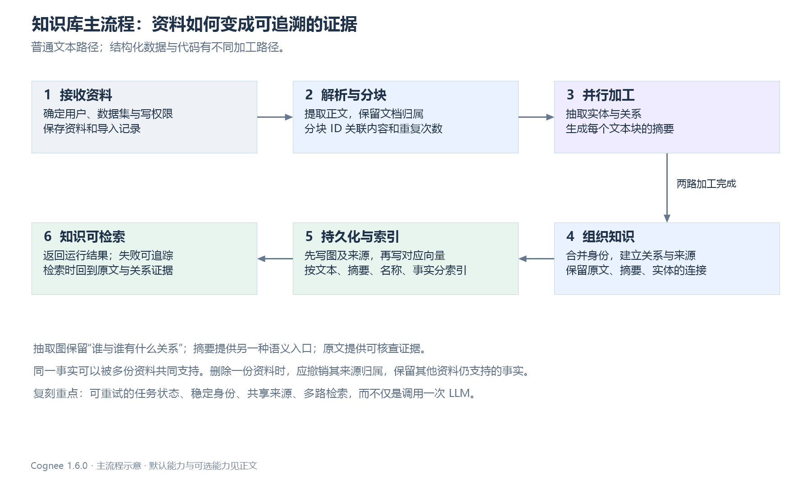
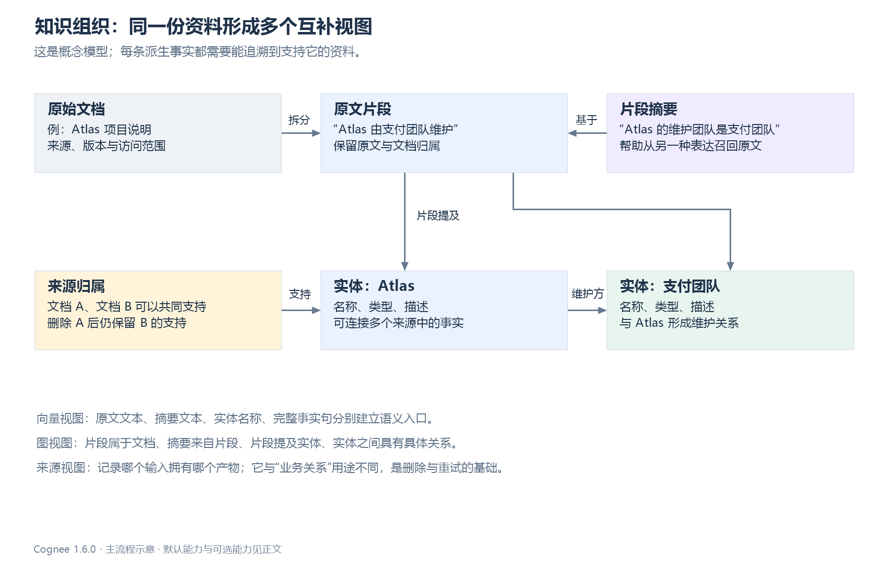
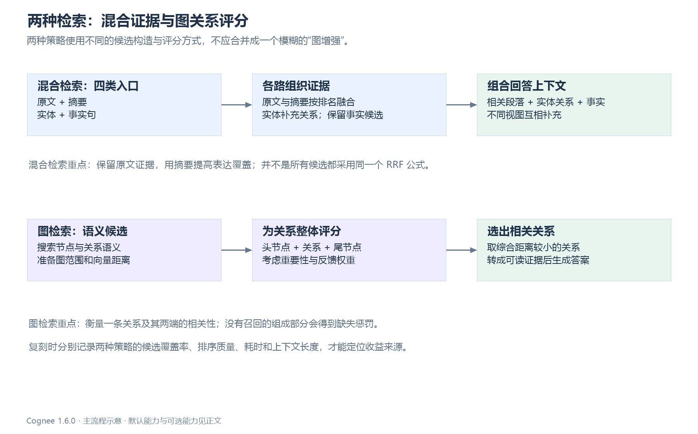
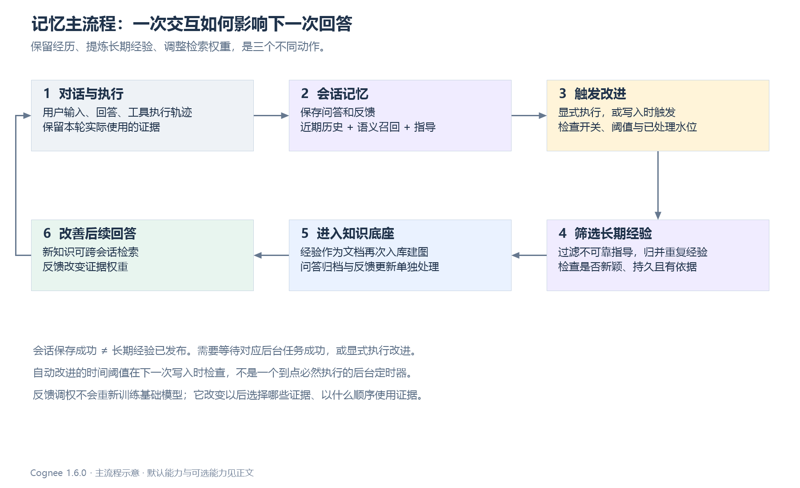
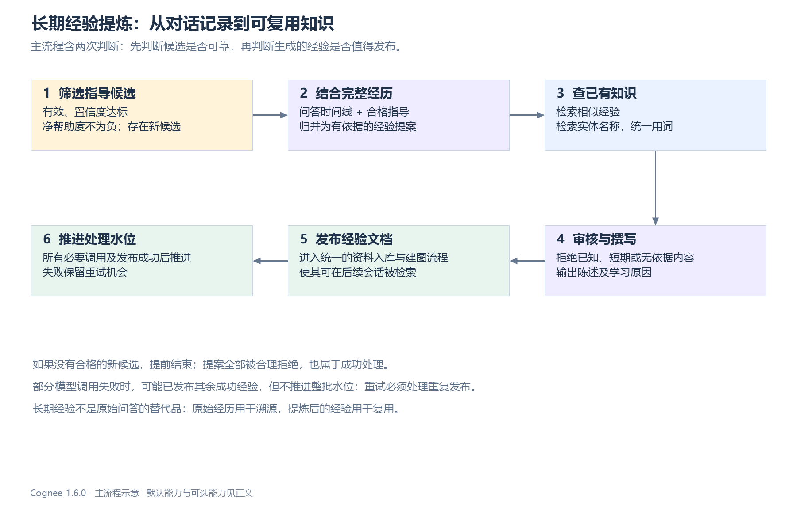
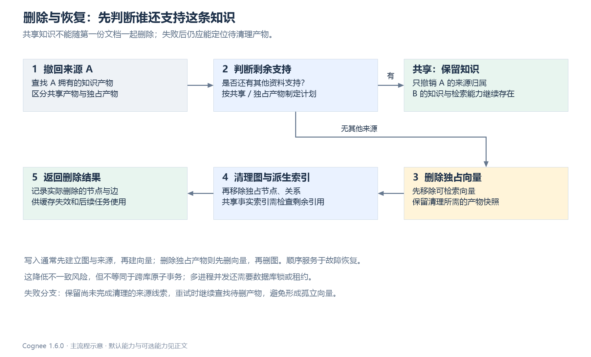

# Cognee 技术细节：知识加工、记忆闭环与复刻取舍

调研日期：2026-09-21。固定源码：Cognee **1.6.0 / `663a2dc15d04bc0d7ec2733a2dd604b7ed1b8c8e`**。配套阅读：[组件与技术架构](Cognee_技术架构分析.md)。图保持组件和主要体验流程的粒度；算法、数据契约、边界条件在正文展开。

本文不是运行报告。源码行为来自固定提交的静态阅读，数值示例用于解释算法；附带的校验脚本只执行从源码提取的纯函数，不覆盖数据库、模型调用或完整流水线。竞品比较使用官方资料，并区分开源实现与托管产品；没有据此推导未经实测的胜率排名。

## 1. 复刻需要保持的五个核心性质

1. **同一资料有多个互补视图。** 原文负责证据，摘要提高表达覆盖，实体关系连接分散信息，来源归属负责治理。
2. **对象身份与模型输出分离。** 模型返回的临时节点编号不能直接成为数据库实体 ID；稳定身份决定去重、更新和删除。
3. **知识检索与会话上下文分工明确。** 长期资料、当前经历和指导的使用规则不同；把聊天记录全部入向量库并不等价。
4. **改进通过可追踪的产物发生。** 反馈调整权重，经历被归档，经验被提炼并发布；不是重新训练基础模型。
5. **每次派生都要能撤销、重试和解释。** 抽取、写图、写向量和改进不在一个全局事务里，来源账本和处理水位决定系统是否可运维。

以下用一个示例贯穿流程。示例是人为设计的解释数据，不是实际模型抽取结果：

| 输入 | 内容 | 用途 |
| --- | --- | --- |
| 文档 A | Atlas 服务由支付团队维护；只有测试环境允许直接重启 | 同时包含事实和不能丢失的限定条件 |
| 文档 B | 支付团队隶属于基础平台部 | 与 A 形成跨文档连接 |
| 会话 | 用户纠正：“生产环境必须先取得变更批准，不能直接重启” | 检查即时指导、长期经验和错误归纳 |
| 查询 Q1 | Atlas 的维护团队属于哪个部门？ | 检查跨资料关系证据 |
| 查询 Q2 | 可以直接重启 Atlas 吗？ | 检查原文条件与会话修正，而非只找实体 |

## 2. 资料如何变成知识：具体输入、处理和产物



### 2.1 导入与加工是两个契约

`add` 解决输入来源、授权数据集和数据登记；`cognify` 读取数据项并执行适合数据类型的加工任务。标准文本链中，文档分类、分块、图抽取与摘要、存储是主干，额外 provenance 与矛盾处理受配置控制。永久 `remember` 路径负责串联相关调用。[add][T1]、[cognify][T2]

复刻时建议把外部接口与内部状态对应起来：

| 阶段 | 输入 | 核心输出 | 可重试依据 |
| --- | --- | --- | --- |
| 接收 | 字节流/路径/文本、来源标识、范围 | 原始资料及 Data 记录 | 来源标识、内容哈希、请求幂等键 |
| 解析 | Data、格式配置 | Document、提取正文 | 源版本与解析器版本 |
| 分块 | 正文、chunker 参数 | Chunk 列表、文档关系、稳定块 ID | 精确块文本、内容哈希、重复序号 |
| 抽取 | Chunk、输出 schema、可选本体 | 临时节点与关系 | Chunk ID、模型/提示词版本、校验结果 |
| 摘要 | 同一 Chunk | TextSummary、来源 Chunk ID | Chunk ID、摘要模型/提示词版本 |
| 组织 | 抽取结果与已知对象 | 稳定实体、关系、出处 | 身份规则、关系键、来源归属 |
| 持久化 | 节点/边/索引内容/归属 | 图、向量及运行进度 | 产物清单、每步结果、未完成操作 |

表中“建议增加的版本和幂等键”是复刻契约，不表示 Cognee 每层都已经持久化同名字段。尤其要防止“输入文件名相同”被误当成“输入版本相同”。固定版本会拒绝某些已存在但内容改变的文档通过 add 覆盖，要求 update。[输入校验][T1]

### 2.2 块 ID：用内容降低位置变化带来的连锁重建

固定版本采用：[块身份][T3]

```text
content_hash = SHA256(exact_text.encode("utf-8"))
chunk_id = UUIDv5(NAMESPACE_OID,
                 document_id + ":" + content_hash + ":" + occurrence)
```

`occurrence` 用于区分同一文档中完全相同的多个块。由此得到：同一文档、同样文本、同样重复序号的块 ID 不变；只移动位置不直接改变 ID；空格或标点改变可能导致哈希改变；相同文本在不同文档中仍属于不同块。

这不保证一次编辑只改一个块：如果 chunker 的边界随文本变化而移动，多个块的文本都会改变。相同段落的重复次数变化也可能影响 occurrence 对应。复刻验收要测试“块内容不变”的情形，同时单独测分块算法的边界稳定性。

### 2.3 模型图输出如何变成稳定实体

普通 KnowledgeGraph 输出可以理解为下面的结构。`n1/n2` 是此次抽取的局部编号，不是持久实体身份：[输出模型][T4]、[抽取入口][T5]

```json
{
  "nodes": [
    {"id":"n1","name":"Atlas","type":"Service","description":"业务服务"},
    {"id":"n2","name":"支付团队","type":"Team","description":"Atlas 的维护团队"}
  ],
  "edges": [
    {"source_node_id":"n1","target_node_id":"n2",
     "relationship_name":"maintained_by",
     "description":"Atlas 服务由支付团队维护。"}
  ]
}
```

组织阶段先验证输出形状、处理重复的局部节点 ID，然后映射到 Entity 和 EntityType。普通 Entity 的身份字段是 name，DataPoint 的身份计算按类名建立 UUIDv5 命名空间；字符串规范化包括小写、空格替换为下划线和移除单引号。类不同，即使值相同也不是同一 ID。[DataPoint 身份][T6]、[构造节点与边][T7]

固定版本还有一个容易遗漏的例外：**同一个块的抽取结果里出现多个相同规范化名称的节点**，会按类型、描述、局部节点 ID 排序，使用名称、块 ID 和序号生成不同实体 ID。这能保留一个块中显式区分的同名对象；但不同块中各出现一次的同名实体仍可能按名称合并。它不是基于语境的完整实体消歧。

| 情况 | 当前规则倾向 | 复刻要注意什么 |
| --- | --- | --- |
| 两个块都只有一个 Atlas | 名称 ID 汇聚到同一实体 | 适合确实是同一服务的资料 |
| 一个块明确提到两个同名 Atlas | 加入块与序号区分 | 不要只抄“按名称 UUID”而丢掉例外 |
| 两个无关项目分别叫 Atlas | 可能误合并 | 需要范围、类型、外部主键或消歧候选 |
| Atlas 与“阿特拉斯服务” | 名称不同，未必自动合并 | 别名/本体或额外消歧能力需要单独设计 |
| 新块给同名实体更丰富描述 | 复用对象并不等于自动融合全部描述 | 保存多来源描述或定义合并规则，不能默认为模型会补全 |

这是 Cognee 的重要权衡：简单稳定 ID 降低重复并方便连接，同时会引入误合并风险。企业复刻建议先使用保守身份：`workspace + external_id` 优先，其次类型、规范名和消歧结果；不要在没有证据时把所有同名对象合成一个。

### 2.4 原文、摘要、实体如何保持连接



原文块具有文档归属和 `contains` 引用；实体关联 EntityType，实体间保存抽取关系；TextSummary 通过 `made_from` 引用块，并保存 `source_chunk_id`。摘要 ID 由块 ID 和固定的 `TextSummary` 标识生成。[摘要实现][T8]

并行图抽取与摘要任务的实现有一个对移植很关键的细节：图抽取修改原块的关联内容，摘要引用同一个块对象；外层返回摘要，之后递归遍历摘要便能抵达块和抽取图。它依赖共享对象和两个任务都已完成。[并行加工][T9]、[对象转图][T10]

如果在 Rust 中把块克隆给两个异步任务，再只保存摘要任务返回的克隆，图抽取产物可能不会被遍历到。建议显式返回：

```text
KnowledgeBatch {
  chunks, summaries, entities, entity_types,
  semantic_relations, structural_links,
  artifact_ownership, extraction_diagnostics
}
```

先把并行结果合并成这个中间对象，再持久化。这样可以清楚验证“摘要对应哪个块”“每条关系来自哪个输入”，而不依赖隐含对象引用。

### 2.5 关系去重不等于丢弃重复来源

普通关系的去重键由 `source_id + target_id + relationship_name` 构成。`edge_object_id` 标识具体图关系；同一关系在后续文档中再出现，可能不重复创建图边，但仍需记录新增来源。固定实现会在去重前收集块产生的关系身份和 provenance 边，从而保留这类支持信息。[关系构造][T7]、[边属性][T11]

这也暴露普通三元组模型的表达边界：同一头、谓词、尾在两个时期分别成立，若时间没有进入身份或独立事件模型，不能仅靠“多写一遍相同三元组”形成完整历史。时态任务是额外机制，不能把普通 dedup 自动解释成双时态语义。

## 3. 图与向量到底各写了什么

### 3.1 索引不是只有“文档向量”

节点索引按 DataPoint 类型和 `metadata.index_fields` 分组。一个对象的多个可索引字段可以进入不同集合；空字段跳过；Embedding 分批并受并发限制。[节点索引][T12]

| 索引 | 主要嵌入内容 | 对问题的作用 | 对应关系 |
| --- | --- | --- | --- |
| `DocumentChunk_text` | 原文块 text | 找证据与限定条件 | 可直接关联块和文档 |
| `TextSummary_text` | 块摘要 text | 让概括性问法找到具体块 | 通过 source_chunk_id 找回原文 |
| `Entity_name` | 实体 name | 定位对象，进入其关系邻域 | 实体 ID 对应图节点 |
| `EntityType_name` 等 | 类型或其他声明为索引字段的内容 | 某些策略的节点候选 | 是否使用取决于检索器 |
| `EdgeType_relationship_name` | 优先完整 edge_text，缺失时为关系名 | 检索完整事实语义 | 一个文本行可关联多个图边 |
| `Triplet_text` | 三元组可读文本 | 可选关系增强 | 依赖三元组增强是否执行 |
| `SessionQAVector_text` | 问题 + 回答 | 从较早会话轮次补充历史 | 以 QA ID 关联会话状态 |

`EdgeType` 的身份基于检索文本。同一句事实文本若被多条边复用，它们可以映射到同一个语义行；图边身份则由端点与关系确定。**检索文本 ID 与业务关系 ID 不是一对一。** 这直接影响删除和反馈归因。[边索引][T13]、[边默认文本][T11]

### 3.2 写入顺序为何不能随意并行

普通存储路径大致遵循以下约束：[存储协调][T14]

```text
构造并去重节点/边
→ 准备来源归属或后端回滚账本
→ 写节点及对应来源
→ 写节点向量
→ 写边及对应来源
→ 写边语义索引
→ 处理其余配置要求的产物
```

支持图原生来源引用的后端，将首次来源尽量折入同一图写入语句；共享产物的额外归属仍需附加处理。不支持的后端可使用关系库回滚账本。不同适配器的来源写入能力不完全相同，不能假定所有后端都具有相同原子性。

为什么不 `join!(write_graph, write_vectors)`？假设向量写成功、图写失败：若来源只存在图里，查询可能命中一条没有出处、清理器也无法定位的向量。先建立图与归属，使后续向量失败时仍可发现产物。代价是暂时存在尚未完成向量索引的图节点，需要任务恢复或回滚。

这是一种补偿式恢复设计，不是分布式事务。统一存储接口里的 `HYBRID_WRITE` 能力也不等价于全局事务；固定工厂的混合提供者注册表为空，不应把尚未注册的能力当作默认部署保障。[统一工厂][T15]

### 3.3 复刻更稳健的发布协议

建议每次加工生成 `generation_id`，产物写入时携带 source_version 和 generation；只有该版本所需图与索引完成后，元数据事务切换 `published_generation`。查询限定已发布代，清理旧代异步执行。这个协议是复刻建议，Cognee 普通路径并非已经完整采用此方案。

这种设计需要额外的过滤与存储空间，但能避免用户在处理中读取半套知识。至少应保留三类状态：业务资料版本、加工运行状态、索引就绪状态。仅用一个 `processed=true` 难以表达它们。

## 4. Hybrid：原文、摘要、实体与事实如何一起检索



### 4.1 候选产生：两条大路径、四类语义入口

固定 HybridRetriever 构造器的局部默认值包括 chunks_top_k=5、entities_top_k=5、max_edges_per_entity=10、facts_top_k=5；外层 recall 的 top_k 默认值和参数传递可能改变最终行为，不能把这些数值当成所有公开调用的固定返回条数。[HybridRetriever][T16]

检索先准备一次查询 Embedding，再并行处理：

| 路径 | 候选 | 后处理 |
| --- | --- | --- |
| 段落路径 | 原文候选取约 2K，摘要候选取配置值或 K | 摘要关联回块，补取缺失原文，按块合并两份名次 |
| 实体与事实路径 | 实体名称候选、完整关系文本候选 | 实体一跳邻域形成关系条目；用关系语义名次帮助选择边；事实去除重复与越界内容 |

图为空时 Hybrid 的入口仍可能报 NoDataError，不宜假设它一定能在“只有向量、没有图”的半成品库上工作。某些子路召回失败会降级为空，但整体前置条件仍然存在。[Hybrid 入口][T16]

### 4.2 原文与摘要融合的精确公式

设最终段落数为 K，两个通道名次从 **0** 开始：

```text
k_rrf = max(30, min(60, 20 + 2K))
R(c) = Σ [1 / (k_rrf + rank_lane(c) + 1)]
I(c) = 0.75 + 0.5 × clamp(importance_weight(c), 0, 1)
Score(c) = R(c) × I(c)       # 未启用 truth / personal 因子时
```

不存在的通道不贡献分数。最终按 Score 降序，再以基础 RRF、最佳名次和块 ID 打破平局。缺失重要性默认 0.5，因此乘数为 1。可选 truth 与 personal 因子另乘，但受配置、数据和 epoch 条件约束。[排名实现][T17]

以 K=5、k_rrf=30 为例：

| 原文块 | 原文名次 | 摘要名次 | 基础 RRF | 重要性 | 最终分数 |
| --- | ---: | ---: | ---: | ---: | ---: |
| A | 0 | 未召回 | 1/31 = 0.032258 | 0.5 | 0.032258 |
| B | 4 | 0 | 1/35 + 1/31 = 0.060829 | 0.5 | 0.060829 |
| C | 1 | 2 | 1/32 + 1/33 = 0.061553 | 0 | 0.046165 |

因此排序为 B、C、A。B 虽然原文只排第五，但它也被摘要通道支持；C 的双路排名略好，却因重要性较低被降权。这里融合的是**名次**，不是把两个数据库原始距离直接相加。

这有利于不同表达方式互补，但双路命中并非两个独立来源：摘要来自同一原文。对高置信问题不能把“两路命中”当成“两份文档交叉验证”。

### 4.3 实体与事实路径不是另一份段落 RRF

实体名称命中后，检索器取一跳邻域，只保留与命中实体连接的关系，去掉邻居之间无关的边；每个实体的边数受上限限制。关系文本命中的名次用于给关系条目排序。[实体扩展][T18]

独立事实路则去掉已经显示在实体关系中的 EdgeType 文本，按候选顺序选取事实。有 NodeSet 范围时，因为 EdgeType 行本身不携带足够的节点范围信息，需要用允许实体实际可达的关系文本 ID 过滤。若缺少范围内实体，不能直接把全库事实候选放进上下文。[事实选择][T19]

固定实现还要求事实文本按空白拆分后至少有三个词。英文句子容易满足，连续中文句子可能被当成一个词而丢弃。中文复刻应把这个规则改成语言适配的可用性检查，并用中文事实召回测试验证；不能只更换中文 Embedding 就认为语言适配已完成。

### 4.4 上下文究竟包含什么

Hybrid 最终上下文主要分为相关段落、实体关系、相关事实，可按配置加入全局信息。摘要参与排序和块关联，但标准上下文格式并不把每份摘要单独再输出一遍。这个设计能减少同一块与摘要的重复 token。[上下文组织][T20]

对于 Q2“可以直接重启 Atlas 吗”，实体名可能帮助找对服务，但正确回答依赖原文中的“只有测试环境”和会话中的“生产要批准”。这说明原文路径有不可替代的作用：图抽取若遗漏环境条件，再好的实体邻域也无法凭空恢复。

## 5. GraphCompletion：一条关系如何被打分

### 5.1 先构造候选图，再映射语义距离

查询 Embedding 可复用于节点和关系集合；向量返回节点/边文本候选，随后创建全图、按 ID 过滤的图或可配置的局部邻域投影。配置 neighborhood_depth 时，使用候选节点作为邻域种子；否则不应笼统描述成固定 k-hop BFS。[向量候选][T21]、[关系检索][T22]

候选规模和最终返回数是两个参数：例如底层函数有 wide_search_top_k 与 top_k。前者太小可能让正确关系某个组成部分未被命中，后者再大也补不回该部分的相似度。当前候选相关 ID 使用集合去重再转列表，局部邻域种子截断也不能被表述为严格全局最近的 N 个节点。

同一个节点若存在多个索引字段，图上的单个距离位置会被依次映射的命中更新；不是自动取所有字段的最小距离，也不是 Hybrid 的 RRF。复刻应有意选择字段融合策略，并记录与上游的兼容性差异。[距离映射与评分][T23]

### 5.2 实际评分公式：越小越相关

对图关系 `(u, e, v)` 的每个组成部分 x：

```text
d_x = 对应向量距离；没有命中则使用 penalty（底层默认 6.5）
w_x = importance_weight；无法解析时使用 0.5
a_x = (2 - w_x) × d_x

若 β <= 0，或 a_x >= penalty，或 a_x < 0，或 a_x > 2：
    b_x = a_x
否则：
    f_x = clamp(feedback_weight，0，1)，无法解析时使用 0.5
    b_x = (1 - β) × a_x + 2β × (1 - f_x)

TripletScore = b_u + b_e + b_v   # 暂不启用个人偏好因子
取分数最小的 k 条关系
```

注意反馈资格检查使用的是**重要性调整后的 a**，不是原始距离 d。缺失惩罚也先乘重要性因子；默认 w=0.5 时，6.5 会变成 9.75，然后跳过反馈混合。评分函数本身没有像 Hybrid 那样对 importance_weight 做 0..1 截断，因此入口应明确合法范围。[精确实现][T23]

### 5.3 数值例子与参数影响

假设头、边、尾距离分别为 0.2、0.3、0.4，重要性均为 0.5：

| 情形 | 各部分结果 | 关系总分 |
| --- | --- | ---: |
| β=0，无反馈影响 | 0.30、0.45、0.60 | 1.35 |
| β=0.2，反馈均为 0.5 | 0.44、0.56、0.68 | 1.68 |
| β=0.2，反馈均为 0.9 | 0.28、0.40、0.52 | 1.20 |
| 头节点没命中，β=0.2，反馈均为 0.9 | 9.75、0.40、0.52 | 10.67 |

中性反馈并非对绝对分数恒等变换。所有组成部分均符合混合条件且反馈相同的情况下，它通常只是整体线性改变；一旦缺失惩罚、资格条件或反馈不同，关系之间的排序可能改变。高反馈也不能把未召回部分的 9.75 惩罚“洗掉”。

提高 β 会让历史帮助程度影响更大，也可能放大旧任务偏好对新问题的干扰。提高实体重要性会降低其有效距离，但“重要”不等于“当前问题正确”。建议保留 β=0 的对照实验，分别测新主题问题和重复任务问题。

### 5.4 图结构带来的优势和它不解决的问题

Q1 的答案跨 A 与 B 两份资料。正确实体合并后，图可以显式表达 Atlas、支付团队、基础平台部的连接，方便把两条事实一起给模型。相比只按整个原文块找相似内容，关系视图可以减少无关上下文。

但当前按三元组打分并不等于全局路径推理器。它不自动保证选中的两条关系构成完整解释路径，也不自动证明它们来自互相独立的可靠来源。若业务必须返回“推理路径”，建议增加路径完整性约束、来源验证与最大路径预算，并把它作为新能力单独评测。

## 6. 会话记忆：保存、选择和使用分别做什么



### 6.1 一轮问答保留的不只是消息文本

SessionManager 保存问题、答案、上下文字符串、反馈，以及 `used_graph_element_ids` 和 `used_session_context_ids`。后两者将回答与被使用的知识、指导连接起来。随后尝试把问答拼接文本写入会话向量集合；索引失败为 fail-open，问答缓存仍可能已成功保存。[会话管理][T24]、[会话向量][T25]

因此要区分：会话记录已保存、会话语义索引就绪、问答已归档、经验已蒸馏。四者不能合成一个“记忆成功”状态。上下文正文也不能假定每次完整持久化；某些答案生成路径只有启用相应上下文摘要时才保存非空 context_to_store。[Completion][T26]

### 6.2 历史窗口与语义回忆

默认近期窗口为最近 10 轮；会话语义召回再尝试找最多 3 个相关 QA ID。两者取并集、去重并按时间排序，交给后续会话提示词。向量缺失或失败时退回近期窗口。范围标签由用户和会话 ID 组成，避免直接在全部会话中查历史。[历史选择][T25]

这与 recall 的“会话优先快捷查询”不是同一个机制。前者用于准备生成答案的历史，后者选择从哪个来源返回结果。复刻如果把这两层混为一谈，会出现“会话检索有结果，却没有实际参与答案生成”的难排查问题。

### 6.3 指导内容及使用门槛

指导包括目标、规则、偏好、经验，以及 Agent 的工具规则、流程状态、成功经验、失败教训、环境事实等。单条内容有长度限制、置信度与帮助/伤害计数，不只是任意字符串列表。[指导模型][T27]

固定版本存在两类不同门槛：

| 用途 | 门槛中的关键条件 | 为什么不同 |
| --- | --- | --- |
| 直接服务回答 / 偏好使用 | 置信度门槛，且采用从未被评为 harmful 的限制 | 直接影响当前行为，采取更保守策略 |
| 长期经验蒸馏 | active，confidence ≥ 0.75，clamped_net_helpfulness ≥ 0 | 允许有过负评但总体仍有帮助的材料进入后续审核 |

例如 helpful=3、harmful=1 的指导可以进入蒸馏，但不能因此推断它仍可直接服务回答。蒸馏不是简单放宽门槛，因为后面还有提案与撰写审核。复刻时要分别定义“可提供给当前模型”与“可作为经验提炼材料”，并让调试信息说明被拒原因。[蒸馏门槛][T28]

### 6.4 自动改进何时发生

默认自动改进配置的条数阈值为 1、秒数阈值为 0，相当于默认每次符合条件的调用触发；调整后按新条数或经过时间判断。**时间阈值只在 remember 调用时检查**；没有新调用时不会凭空定时触发。状态读取失败可按 fail-open 方式运行。[自动改进门槛][T29]

如果业务将阈值设为 10 条，而用户只交流 7 条便离开，应用需要显式结束会话处理或后台调度。不能对用户承诺“几分钟后必然进入长期记忆”，除非复刻服务另外实现了定时任务。

## 7. Improve 九阶段：什么必须成功，什么允许跳过

下表顺序来自固定注册表。无对应会话、关闭开关、无新数据、后端不支持或缺少 LLM 都可能导致跳过，具体条件因阶段不同。[阶段顺序][T30]、[阶段实现][T31]

| 顺序 | 阶段 | 输入 → 产物 | 关键门槛 / 失败语义 |
| ---: | --- | --- | --- |
| 1 | feedback_weights | 已评分回答及使用 ID → 图权重 | 需要会话和后端能力；失败记录但不作为唯一致命阶段 |
| 2 | persist_session_qa | 缓存问答 → 知识图中的问答归档 | **唯一 fatal 阶段**；失败停止后续流程，配置不允许禁用它 |
| 3 | persist_agent_traces | Agent 步骤反馈 → 可检索的轨迹知识 | 按持久化水位跳过已处理步骤 |
| 4 | extract_agent_context | 未处理轨迹 → Agent 指导经验 | 需要可用会话管理、自动反馈及 LLM；单会话失败不阻断其他会话 |
| 5 | distill_sessions | 合格指导和问答 → 长期经验文档 | 需要 LLM；每个会话独立检查候选、水位和发布结果 |
| 6 | update_user_preferences | 偏好材料 → 用户偏好状态 | 受个性化配置约束；并非默认对全部人自动建立画像 |
| 7 | build_truth_subspace | 合格锚点及知识 → truth 相关状态 | 显式 opt-in；不能据名称理解成自动事实验证器 |
| 8 | triplet_enrichment | 已有图关系 → 三元组语义索引 | 受三元组开关、后端能力和新写入情况等约束 |
| 9 | global_context_index | 图知识 → 全局上下文索引/摘要 | 按配置与后端能力执行，可能无新工作 |

每阶段都有自己的 status/reason。`skipped` 与 `errored` 不应展示成同一个状态；前者可能是正常配置结果，后者需要重试或处理。门槛优化自身无法判断时可选择继续运行，而不能仅因门槛检查异常就永远跳过工作。

`memify` 也不能简单等同于“重新思考整张图”。固定默认任务在启用 triplet_embedding 时可提取三元组并建立索引，不需要 LLM；未启用或没有相应工作时可能没有实质增强。真正的会话闭环应按 improve 的阶段定义理解。[默认 memify 任务][T32]

## 8. 经验蒸馏：两轮模型判断和一个发布协议



### 8.1 候选检查与时间线

先解析用户对目标数据集的写权限，加载 active 指导，并执行置信度和净帮助度过滤。没有合格指导时直接返回 `no_gated_entries`；全部合格指导已被当前水位覆盖时返回 `no_new_entries`，避免不必要的模型调用。[蒸馏入口][T28]

若存在新指导，处理时使用完整合格指导池及完整问答时间线，而非只把新指导孤立交给模型。这有助于理解纠正发生在什么问题之后，也意味着随着会话增长，单次改进成本可能增长。

构建模型输入时会截断字段：问题与答案各最多 1200 字符、反馈 200、候选指导 280。Curator 按每批 6 个时间线块切分，默认并发为 5。模型常量中虽然定义了 16000 字符预算，但实际分批核心规则是块数，不能把常量名当成已严格执行的总 token 上限。[蒸馏实现][T28]、[蒸馏模型和常量][T33]

### 8.2 第一次判断：Curator 归并经验提案

Curator 输入时间线与候选，输出 `working_statement + member_entry_ids`。它要判断哪些内容是可复用经验、哪些重复指导可以合并、哪些结论有实际用户或经历依据。提示词要求避免把助手自己说过的话自动提升为长期真相。

例如示例会话可以提案“对 Atlas 的生产变更，应先确认变更批准”。不应把“本次只检查测试环境”归纳为“以后所有环境都可以直接重启”。前者是持久规则候选，后者遗漏了环境限定。

### 8.3 第二次判断：Writer 检查新颖性并发布陈述

每个提案会检索两类补充：`session_learnings` 范围内相似块，最多 5 条；实体名称词汇，最多 20 条。Writer 同时看到提案、成员指导、相似旧经验和词汇，决定是否接受，并返回陈述、实体和学习原因。拒绝理由包括 already_known、not_durable、unsupported。[蒸馏实现][T28]

这一步不是严格的逻辑蕴含证明。相似搜索失败会退回空结果，因此失去去重上下文时仍可能继续生成；Embedding 漏召回也会让旧知识看起来像新知识。复刻若要求更强的发布保证，可以把相似检索失败改成“暂缓发布”，但这是与上游不同的可用性取舍。

### 8.4 发布与水位必须分清成功、空结果和失败

接受的经验写成确定格式的 Markdown，包含 session ID、陈述和学习原因，再执行 add 与 cognify。只有所有必要 Curator/Writer 调用及发布都成功，才推进本次指导集合的蒸馏水位。模型成功返回“没有值得保留的经验”可推进水位；模型请求失败不等于“没有经验”。[发布与水位][T28]

| 本轮情况 | 是否可能发布经验 | 是否推进蒸馏水位 |
| --- | --- | --- |
| 没有合格指导 | 否 | 无需处理 |
| 没有未处理指导 | 否 | 保持原值 |
| 正常处理，但没有提案或全部合理拒绝 | 否 | 是，避免反复做相同判断 |
| 全部成功且存在接受经验 | 是 | 是 |
| 部分 Curator/Writer 失败，其余成功 | 可能先发布成功部分 | 否，报错以保留重试机会 |
| 发布入库/建图失败 | 可能已有部分产物 | 否，需要入库恢复及蒸馏重试 |

同一 session 中完全相同的经验文本可以借内容身份减少重复，但不同措辞仍可能重复；同样陈述放到不同 session，标题中的 session ID 也不同。**确定文档模板不是跨会话语义去重。** 建议复刻增加 lesson_id、提案成员集合、发布幂等键，并为跨会话重复定义单独的合并策略。

### 8.5 两种水位的作用域不一致

问答和轨迹持久化水位主要跟随 user/session；会话经验蒸馏水位是 user/session/dataset 维度。已经持久化到一个数据集的相同问答，不会仅因换一个目标数据集就当然重新桥接过去；但蒸馏可以针对另一数据集进行自己的去重检查。[水位作用域说明][T38]、[蒸馏水位][T28]

复刻必须提前选择产品语义：一个会话归属于一个 workspace，还是能向多个知识范围发布？若允许多目标，持久化状态应明确标记目标，不能只保留全局 `processed=true`。

## 9. 反馈：如何更新、如何影响检索、哪里可能重复

### 9.1 权重更新是指数平滑

评分 s 为 1..5，先归一化：`r=(s-1)/4`。更新规则：[反馈处理][T34]

```text
w_new = round(clamp(w_old + α × (r - w_old), 0, 1), 4)
0 < α <= 1
```

默认反馈学习率配置为 0.1。w_old=0.5 时，一次 5 分变成 0.55；再一次 5 分变成 0.595；随后 1 分变成 0.5355。隐式反馈可以使用更小的有效学习率，源码通过单独系数控制。

更新针对回答实际记录的节点和边，不是对整个主题的所有知识普遍加分。也不能把这个权重解释为客观真值概率；它衡量特定使用记录上的反馈趋势，仍受回答生成质量和用户偏好影响。

### 9.2 写了权重不代表查询已经使用

Improve 会根据能力更新权重，即使查询默认反馈影响为零。读时的 feedback_influence 决定 GraphCompletion 是否将权重混入距离；Hybrid 的重要性/RRF 机制与这套关系反馈公式不同。调试时必须记录“有没有权重”“当前查询有没有启用该因子”“最终分数发生了什么变化”。[改进阶段][T31]、[评分实现][T23]

### 9.3 重试机制降低重复，但仍有跨存储窗口

处理元数据记录已应用的节点/边 ID、评分与来源、尝试次数和被剪除的 ID。已成功的部分可以跳过，未成功的部分继续；缺失对象可能已删除，也可能属于其他数据集，需要避免把所有未找到对象立刻视为处理成功。[反馈处理][T34]

不过图权重写入与会话元数据不是一个原子事务。如果权重更新成功后进程退出、尚未写成功标记，重试可能再次更新。这是从写入边界推导的风险，不是这里执行过的故障实测。

复刻建议为每个 `(feedback_event_id, target_artifact_id, feedback_revision)` 建唯一应用记录，并与权重变更同事务提交；若图后端无法做到，则通过目标数据库的幂等操作或单独事件物化层实现。评分改动还要定义“替换旧评分”或“追加新事件”，否则用户改单可能重复强化。

## 10. 删除、更新与并发：真正影响可用性的细节



### 10.1 共享产物怎样删除才正确

若 A、B 都支持关系 e，删除 A 时保留 e，只移除 A 的归属；只有最后一个支持来源消失后才计划删除 e。删除独占产物前，先保存需要清理的图对象/索引快照，移除向量，再移除图。共享 EdgeType 文本要检查剩余边引用，不能因为删除一条边就删除其被其他边复用的语义行。[来源删除规划][T35]

| 故障位置 | 当前顺序的价值 | 复刻需要检查 |
| --- | --- | --- |
| 图写成功，向量写失败 | 来源记录仍能定位派生对象 | 重试是否更新同一身份、是否出现部分查询可见性 |
| 向量删除失败 | 尚未硬删除的图/来源仍提供清理线索 | 重试能否找到相同待删集合 |
| 向量已删，图删除失败 | 已避免独占旧向量继续被普通语义检索命中 | 图关系读取是否仍受撤回状态约束 |
| 共享文本仍有其他边引用 | 保留共享向量避免损坏其余知识 | 最后一条引用删除后是否最终清理 |
| 文档更新改变部分块 | 内容身份有助于识别不变块 | 旧块与新块的来源差异、事实撤销和新版本发布 |

仅删除文件和 Document 节点不够；仅按来源删除全部向量也可能误删共享产物。建议提供 dry-run 删除计划用于调试，并用来源集合不变量校验真实执行结果。

### 10.2 锁与并发不是实现细枝末节

当前完整 Pipeline 编排按数据集加锁。同一数据集写入串行，不同数据集可以并行；在一次多数据集调用内部，数据集仍按顺序处理。嵌套同数据集调用通过执行上下文识别已持有锁，防止自锁。锁顺序要求先数据集锁、再有限的数据库上下文队列槽位。[编排][T36]、[数据集锁][T37]

锁注册表是进程内 `asyncio` 对象，不保护多个服务 worker。复刻若启动多个 Rust 实例，应使用数据库 advisory lock、租约或带 fencing token 的作业所有权；只有进程内 mutex 不足以保证同一资料不会并发发布两代产物。

另有两种名字相近的 run_pipeline：完整模块编排负责授权、数据集和运行状态；轻量任务运行器负责执行 TaskSpec/BoundTask。移植时应依据实际入口使用的完整编排路径，不能因函数同名而省略锁和状态管理。[完整编排][T36]

## 11. 成本与延迟来自哪里

没有实测数据时，用结构化成本模型比给一个臆测 QPS 更有价值。设 N 为块数，E 为待索引实体数，F 为不同事实文本数，L 为待发布经验数：

| 路径 | 主要成本 | 可调节因素 |
| --- | --- | --- |
| 普通文本加工 | 每块图抽取与摘要的模型工作，原文/摘要/实体/事实 Embedding，图与索引写入 | 块尺寸、并发、缓存、模型、是否做摘要与关系增强 |
| Hybrid 查询 | 一次查询 Embedding、多集合搜索、一跳邻域、上下文和答案生成 | 各路 top-k、每实体边数、token 预算、生成模型 |
| GraphCompletion | 节点/边搜索、图投影、三元组评分、生成 | 候选图大小、邻域深度、字段数量、最终 k |
| 会话改进 | 问答/轨迹归档、候选提案、每提案相似检索和 Writer、L 份经验重新加工 | 触发阈值、候选过滤、去重、批量、发布规则 |

图抽取与摘要并行降低单块墙钟延迟，但不减少二者的 token 总成本。经验作为文档重新加工意味着“提炼一次”之后还有入库和索引成本。完整会话时间线参与蒸馏也可能让后期轮次更贵。实际请求数受批处理、提取器和失败重试影响，不能直接把 N 当成某个部署的准确 HTTP 调用数。

优化顺序建议是：先测无效重复加工，再控制候选与上下文，最后才考虑更复杂的图裁剪。删除摘要、关系或指导功能之前，要用消融证明被删能力在真实题集里没有独立收益。

## 12. 与其他方案比较：优势成立的条件是什么

**没有证据支持“Cognee 全面优于竞品”。** 它的突出价值是把资料知识与会话改进结合，并暴露较丰富的可定制流水线；代价是状态更多、写入更重、正确性和运维边界更复杂。下表比较的是机制与适用条件，不是实测排行榜。

### 12.1 机制对照

| 方案 | 主要记忆/知识单位 | 读写机制 | Cognee 相对值得借鉴的地方 | Cognee 可能不占优的场景 |
| --- | --- | --- | --- | --- |
| 基础向量 RAG | 原文块及元数据 | 分块嵌入，近邻召回，生成 | 多视图索引、显式关系、反馈与经历闭环 | 资料简单、问题只需单段证据、低成本快速上线 |
| Mem0 开源路径 | 从消息提取的记忆事实，可选图组件 | 以记忆维护和用户范围检索为主要接口 | 文档加工、原文/摘要/图的组合与统一经验发布 | 主要需求是轻量用户偏好和事实记忆，未必需要复杂文档图谱 |
| Mem0 当前托管 Graph Memory | 记忆节点、实体以及共享实体连接 | 图连接影响综合排序；结合向量与 BM25 | Cognee 显式带类型的实体关系适合关系语义建模 | 希望免部署图数据库、直接使用托管记忆检索 |
| Graphiti 开源 | episode、实体、带时间信息的关系 | 增量图更新；混合全文/向量/图搜索，提供多种重排 | Cognee 对原文、摘要与会话蒸馏的组合较完整 | 时间变化、事实失效与历史查询是第一优先级 |
| Microsoft GraphRAG | 文本单元、实体关系、社区及社区报告 | 建图和社区摘要；local、global、DRIFT 等查询 | Cognee 的在线会话经历和反馈改进更贴近 Agent 交互 | 需要全语料主题概览、社区级总结的离线分析 |
| Letta 当前记忆体系 | Agent 持有并编辑的记忆文件等状态 | MemFS、上下文注入与按需读取、Dreaming 整理 | Cognee 更便于提供独立的知识检索和来源治理服务 | 希望 Agent 直接维护工作记忆，记忆与执行循环紧密结合 |

竞品事实依据分别见 [Mem0 开源仓库](https://github.com/mem0ai/mem0)、[Mem0 当前托管图机制](https://docs.mem0.ai/platform/features/graph-memory)、[Graphiti 官方仓库](https://github.com/getzep/graphiti)、[GraphRAG 查询文档](https://microsoft.github.io/graphrag/query/overview/)、[Letta 当前 Memory 文档源](https://github.com/letta-ai/letta-docs-md/blob/main/configuration/memory/index.md)。开源与托管的实现和演进节奏不同，不应以托管文档推断开源后端内部行为。

### 12.2 比较时最容易犯的三个错误

**把 Mem0 描述成“只有向量”或“图永远不参与排序”。** 当前托管文档描述原生实体连接参与综合分数，并区分这种共现连接与显式带标签的实体关系。因此，Cognee 的可比较差异是关系表达和加工闭环，不是简单的“有图对无图”。旧 open-source 图文档链接目前会跳转到托管版，引用时尤其需要注明范围。[Mem0 托管图说明](https://docs.mem0.ai/platform/features/graph-memory)

**把 Graphiti 和商业 Zep 当成同一个部署。** Graphiti 开源能力包括时间知识图和混合检索；Zep 托管服务还包含其平台与专有数据库服务，不能用开源默认配置的成绩代表商业服务，也不能把商业能力全部归给开源代码。[Graphiti](https://github.com/getzep/graphiti)、[Zep 官方产品说明](https://www.getzep.com/platform/graphiti/)

**把“有全局摘要”当成与 GraphRAG global 完全等价。** GraphRAG global 围绕社区报告进行 map-reduce，DRIFT 利用社区信息扩展局部查询。Cognee 的可选全局上下文索引需要按具体实现和任务测试，名称相似不足以证明覆盖相同问题。[GraphRAG 查询说明](https://microsoft.github.io/graphrag/query/overview/)

### 12.3 什么时候 Cognee 的设计更可能带来收益

| 需求 | 机制上的收益理由 | 需要验证的代价或反例 |
| --- | --- | --- |
| 同一实体散落多份资料 | 稳定身份和关系让资料能连接 | 同名误合并会比普通 RAG 更具破坏性 |
| 问法与原文表达差异大 | 摘要提供第二语义入口，RRF 支持多路命中 | 摘要错误或丢条件会污染排序 |
| Agent 反复执行类似任务 | 会话经验与反馈可改变后续证据和指导 | 旧经验过时、反馈偏置、错误规则被长期化 |
| 要知道事实来自哪里、能否撤回 | 来源归属与删除计划支持治理 | 多后端一致性与共享索引清理增加实现复杂度 |
| 要按业务定制加工 | 任务流水线和数据模型可替换 | 自定义路径可能绕过标准本体、来源或检索预期，需要额外契约验证 |

这些是可检验的机制假设。需要用相同模型、相同资料版本、相同问题集、相同 token 和成本预算比较，才能回答“在我们的业务里是不是更优秀”。不同厂商、不同数据集的公开分数不适合直接拼成排名。

## 13. 复刻测试：应验证行为，不只验证函数有返回

### 13.1 必须保持的不变量

| 不变量 | 最小测试场景 | 错误表现 |
| --- | --- | --- |
| 稳定块身份 | 同文档同内容移位；相同段落出现两次 | 全部下游 ID 漂移，或两段被压成一个 |
| 实体规则可解释 | 跨块同名、同块同名异义、别名 | 无法判断误合并来自模型还是身份层 |
| 来源先于可检索派生产物 | 在图/来源/向量各写入点注入失败 | 孤立向量仍被召回且无法清理 |
| 共享知识不误删 | A、B 同时支持 e，先删 A 再删 B | 删 A 破坏 B；或删 B 后永远残留 |
| 权限覆盖全部检索路 | 不同范围中有相同实体名和事实文本 | 向量、邻域或独立事实路泄漏 |
| 分数方向一致 | Hybrid 高分优先，GraphCompletion 低分优先 | 把两个 score 直接统一降序导致反排 |
| 蒸馏保留限定条件 | 测试/生产、临时/永久、某用户/全团队 | 临时指令变成普遍长期规则 |
| 水位不吞失败 | 模型成功空结果 vs 超时；部分发布后失败 | 超时被当成无结果永久跳过 |
| 反馈可重放 | 图已更新但处理标记未写时重启 | 相同事件重复影响权重 |
| 中文规则适配 | 连续中文事实、中文会话快捷查询 | 词数或分词规则丢掉有效候选 |

### 13.2 对比实验要分层归因

建议用相同语料做五组消融：原文向量；原文+摘要；再加实体与事实；再加会话历史/指导；最后加反馈与蒸馏。每次只引入一个机制，观察其独立收益，而不是直接比较“最完整 Cognee”与“随手搭的弱 RAG”。

至少记录：正确来源 Recall@K、关系证据覆盖率、无依据陈述率、限定条件保留率、跨范围泄漏率、删除完成后的残留率、P50/P95 查询延迟、每文档加工成本、每成功任务成本。记忆系统还要记录“纠正多久后生效”和“错误经验撤回后是否继续影响答案”。

对于 Q1，应检查 A、B 两个必要证据是否同时进入上下文，而不只看最终答案碰巧说对部门；对于 Q2，应检查回答是否明确区分环境，而不是模型恰好凭常识要求审批。这样的评测才能证明知识与记忆管道确实发挥了作用。

## 14. 推荐复刻顺序与需要主动改变的设计

先完成知识加工、Hybrid、来源和删除这条闭环，再做会话与经验，最后评估更复杂的图评分和可选增强。首版应优先复刻能被测试的核心行为，不必复制所有适配器和可选能力。

| 上游机制 | 复刻选择建议 | 原因 |
| --- | --- | --- |
| 显式原文/摘要/实体/事实视图 | 保留 | 各视图解决不同召回问题，容易消融比较 |
| Python 对象共享与递归遍历 | 改成显式中间结果 | 降低并发移植与所有权错误 |
| 名称主导实体身份 | 按业务加强 | 企业同名、跨范围与别名问题通常更突出 |
| 图先写、向量后写 | 保留恢复原则，增加发布代 | 兼顾可重试与查询视图一致性 |
| 单进程数据集锁 | 服务化时替换为跨进程协调 | 多实例不能共享内存锁 |
| 缓存标记与图反馈分步写 | 增加反馈幂等事件 | 减少崩溃窗口重复调权 |
| 自动改进写入时触发 | 保留，并按产品增加结束会话 flush | 避免未达到阈值的会话永远不处理 |
| 蒸馏自动接受即发布 | 接入本项目既有确认规则 | 模型可信度与团队发布权限是两回事 |
| 英文词数与会话分词启发式 | 做中文适配 | 中文问题不能只依赖空白和英文词边界 |

真正有价值的复刻不是模块名称一致，而是面对同一条资料、同一段会话、同一次故障，能解释产物在哪里、为什么被检索、如何纠正、何时撤回，以及成本花在了哪一步。

## 15. 复核材料

图源与重建方式见 [配图目录](assets/cognee/README.md)。[校验脚本](assets/cognee/verify_analysis.py) 从指定本地源码提取纯函数核对块身份、反馈更新、RRF 排序及图评分算例；结果见 [核验记录](assets/cognee/verification_report.json)。源码文件 SHA-256 与固定提交记录见 [source_manifest.json](assets/cognee/source_manifest.json)。这些材料用于复查分析，不替代集成测试或效果评测。

[T1]: https://github.com/topoteretes/cognee/blob/663a2dc15d04bc0d7ec2733a2dd604b7ed1b8c8e/cognee/api/v1/add/add.py
[T2]: https://github.com/topoteretes/cognee/blob/663a2dc15d04bc0d7ec2733a2dd604b7ed1b8c8e/cognee/api/v1/cognify/cognify.py
[T3]: https://github.com/topoteretes/cognee/blob/663a2dc15d04bc0d7ec2733a2dd604b7ed1b8c8e/cognee/modules/chunking/chunk_id.py
[T4]: https://github.com/topoteretes/cognee/blob/663a2dc15d04bc0d7ec2733a2dd604b7ed1b8c8e/cognee/shared/data_models.py
[T5]: https://github.com/topoteretes/cognee/blob/663a2dc15d04bc0d7ec2733a2dd604b7ed1b8c8e/cognee/infrastructure/llm/extraction/knowledge_graph/extract_content_graph.py
[T6]: https://github.com/topoteretes/cognee/blob/663a2dc15d04bc0d7ec2733a2dd604b7ed1b8c8e/cognee/infrastructure/engine/models/DataPoint.py
[T7]: https://github.com/topoteretes/cognee/blob/663a2dc15d04bc0d7ec2733a2dd604b7ed1b8c8e/cognee/modules/graph/utils/expand_with_nodes_and_edges.py
[T8]: https://github.com/topoteretes/cognee/blob/663a2dc15d04bc0d7ec2733a2dd604b7ed1b8c8e/cognee/tasks/summarization/summarize_text.py
[T9]: https://github.com/topoteretes/cognee/blob/663a2dc15d04bc0d7ec2733a2dd604b7ed1b8c8e/cognee/tasks/graph/extract_graph_and_summarize.py
[T10]: https://github.com/topoteretes/cognee/blob/663a2dc15d04bc0d7ec2733a2dd604b7ed1b8c8e/cognee/modules/graph/utils/get_graph_from_model.py
[T11]: https://github.com/topoteretes/cognee/blob/663a2dc15d04bc0d7ec2733a2dd604b7ed1b8c8e/cognee/modules/graph/utils/prepare_edges_for_storage.py
[T12]: https://github.com/topoteretes/cognee/blob/663a2dc15d04bc0d7ec2733a2dd604b7ed1b8c8e/cognee/tasks/storage/index_data_points.py
[T13]: https://github.com/topoteretes/cognee/blob/663a2dc15d04bc0d7ec2733a2dd604b7ed1b8c8e/cognee/tasks/storage/index_graph_edges.py
[T14]: https://github.com/topoteretes/cognee/blob/663a2dc15d04bc0d7ec2733a2dd604b7ed1b8c8e/cognee/tasks/storage/add_data_points.py
[T15]: https://github.com/topoteretes/cognee/blob/663a2dc15d04bc0d7ec2733a2dd604b7ed1b8c8e/cognee/infrastructure/databases/unified/get_unified_engine.py
[T16]: https://github.com/topoteretes/cognee/blob/663a2dc15d04bc0d7ec2733a2dd604b7ed1b8c8e/cognee/modules/retrieval/hybrid_retriever.py
[T17]: https://github.com/topoteretes/cognee/blob/663a2dc15d04bc0d7ec2733a2dd604b7ed1b8c8e/cognee/modules/retrieval/hybrid/ranking.py
[T18]: https://github.com/topoteretes/cognee/blob/663a2dc15d04bc0d7ec2733a2dd604b7ed1b8c8e/cognee/modules/retrieval/hybrid/entities.py
[T19]: https://github.com/topoteretes/cognee/blob/663a2dc15d04bc0d7ec2733a2dd604b7ed1b8c8e/cognee/modules/retrieval/hybrid/facts.py
[T20]: https://github.com/topoteretes/cognee/blob/663a2dc15d04bc0d7ec2733a2dd604b7ed1b8c8e/cognee/modules/retrieval/hybrid/context.py
[T21]: https://github.com/topoteretes/cognee/blob/663a2dc15d04bc0d7ec2733a2dd604b7ed1b8c8e/cognee/modules/retrieval/utils/node_edge_vector_search.py
[T22]: https://github.com/topoteretes/cognee/blob/663a2dc15d04bc0d7ec2733a2dd604b7ed1b8c8e/cognee/modules/retrieval/utils/brute_force_triplet_search.py
[T23]: https://github.com/topoteretes/cognee/blob/663a2dc15d04bc0d7ec2733a2dd604b7ed1b8c8e/cognee/modules/graph/cognee_graph/CogneeGraph.py
[T24]: https://github.com/topoteretes/cognee/blob/663a2dc15d04bc0d7ec2733a2dd604b7ed1b8c8e/cognee/infrastructure/session/session_manager.py
[T25]: https://github.com/topoteretes/cognee/blob/663a2dc15d04bc0d7ec2733a2dd604b7ed1b8c8e/cognee/infrastructure/session/session_embeddings.py
[T26]: https://github.com/topoteretes/cognee/blob/663a2dc15d04bc0d7ec2733a2dd604b7ed1b8c8e/cognee/modules/retrieval/utils/completion.py
[T27]: https://github.com/topoteretes/cognee/blob/663a2dc15d04bc0d7ec2733a2dd604b7ed1b8c8e/cognee/infrastructure/session/session_context_models.py
[T28]: https://github.com/topoteretes/cognee/blob/663a2dc15d04bc0d7ec2733a2dd604b7ed1b8c8e/cognee/modules/session_distillation/distill.py
[T29]: https://github.com/topoteretes/cognee/blob/663a2dc15d04bc0d7ec2733a2dd604b7ed1b8c8e/cognee/api/v1/remember/auto_improve_debounce.py
[T30]: https://github.com/topoteretes/cognee/blob/663a2dc15d04bc0d7ec2733a2dd604b7ed1b8c8e/cognee/modules/improve/registry.py
[T31]: https://github.com/topoteretes/cognee/blob/663a2dc15d04bc0d7ec2733a2dd604b7ed1b8c8e/cognee/modules/improve/stages.py
[T32]: https://github.com/topoteretes/cognee/blob/663a2dc15d04bc0d7ec2733a2dd604b7ed1b8c8e/cognee/memify_pipelines/memify_default_tasks.py
[T33]: https://github.com/topoteretes/cognee/blob/663a2dc15d04bc0d7ec2733a2dd604b7ed1b8c8e/cognee/modules/session_distillation/models.py
[T34]: https://github.com/topoteretes/cognee/blob/663a2dc15d04bc0d7ec2733a2dd604b7ed1b8c8e/cognee/tasks/memify/apply_feedback_weights.py
[T35]: https://github.com/topoteretes/cognee/blob/663a2dc15d04bc0d7ec2733a2dd604b7ed1b8c8e/cognee/infrastructure/databases/unified/provenance_delete_planner.py
[T36]: https://github.com/topoteretes/cognee/blob/663a2dc15d04bc0d7ec2733a2dd604b7ed1b8c8e/cognee/modules/pipelines/operations/pipeline.py
[T37]: https://github.com/topoteretes/cognee/blob/663a2dc15d04bc0d7ec2733a2dd604b7ed1b8c8e/cognee/infrastructure/locks/dataset_lock.py
[T38]: https://github.com/topoteretes/cognee/blob/663a2dc15d04bc0d7ec2733a2dd604b7ed1b8c8e/cognee/infrastructure/session/session_persist_watermark.py
