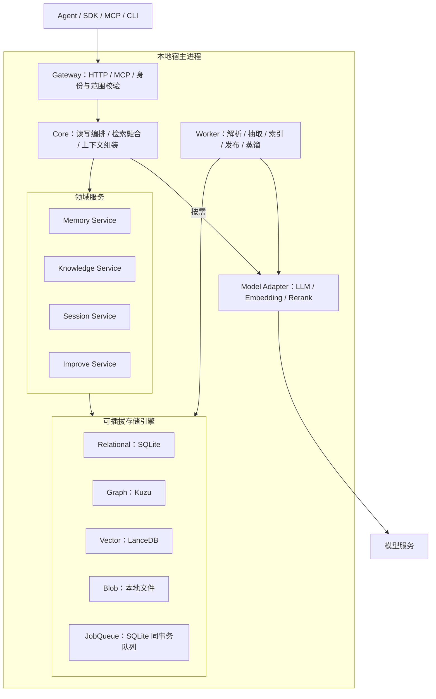

# 记忆 + 知识库平台（Cognee 同类）详细设计

初稿日期：2026-09-22；整合修订：2026-09-23
定位：团队 Agent 的记忆与知识库平台，先交付本地存储版本，保留后续服务化能力，Rust 实现，对标 Cognee（调研基线 v1.6.0，固定 commit `663a2dc15d04bc0d7ec2733a2dd604b7ed1b8c8e`）。

本文是基于现有 openContext/ContextDB 代码与 Cognee 调研（[架构分析](../../Cognee_技术架构分析.md)、[技术细节](../../Cognee_技术细节与方案对比.md)）的**转向设计**。相比之前的 ContextDB V3.1，本次改变四件事：技术栈锁定 Rust；治理模型从「候选审核 → 发布」改为 Cognee 式「自动发布」；存储改为可插拔引擎；交付先落地本地存储版本，SaaS 能力后续演进。继承不变的：workspace/tenant 隔离、来源溯源、删除级联、审计、可注入上下文与预算。

> **实施基线：** 本文统一描述产品与存储设计；存储完整契约见 [A2](#storage-design)，执行顺序见 [本地存储实施计划](../plans/2026-09-22-pluggable-storage-engine.md)。本地固定 SQLite/LanceDB/Kuzu，PG/pgvector 仅保留接口扩展能力；不提供版本化数据库升级。产品目标与当前实现状态分别列示。

> **一级产品目标：** 平台原生支持多个 tenant，以及每个 tenant 下的多个 workspace。tenant/workspace 隔离贯穿认证、scope、资产、来源、任务、文件、图/向量检索、缓存、审计和账本；它不是部署、计费或后续 SaaS 阶段才加入的能力。

---

## 1. 产品边界

### 1.1 做什么

一个支持本地部署的「记忆 + 知识库」平台，目标覆盖 Cognee 的完整记忆闭环：

| 能力 | 含义 | 对应 Cognee 入口 |
| --- | --- | --- |
| 知识库 | 资料导入 → 解析分块 → 实体/关系抽取 → 摘要 → 图/向量索引 → 图/向量/关键词混合检索 | `add` / `cognify` / `recall` |
| 记忆事实 | 用户/团队明确表达的事实、偏好、决策、规则，进图、进向量、可检索 | `remember` |
| 会话记忆 | 问答经历、使用的证据 ID、反馈、执行轨迹，恢复任务上下文 | `recall` + SessionManager |
| 经验蒸馏 | 从会话与指导中提炼长期经验，作为文档重新入库建图 | `improve` |

### 1.2 不做什么

不做 Agent 编排/工具执行、不做通用模型代理、不做互联网爬虫、不做跨后端分布式事务、不做无出处的「经验黑箱」。首版不做 Skill 资产（保留为后续扩展）。

### 1.3 与 Cognee 的关键差异

| 维度 | Cognee | 本项目 |
| --- | --- | --- |
| 语言 | Python | Rust（复用 openContext 基础） |
| 治理 | 自动抽取即入库 | 自动发布，但强制保留来源归属 + 删除级联 + 审计（无人工审核门） |
| 存储 | 多后端适配（统一引擎有声明但工厂常为空） | 显式 `StorageEngine` trait + 能力声明（capability flags） |
| 授权 | 用户/数据集/会话范围 | 原生多 tenant、多 workspace；认证、任务和每条检索分支都贯穿 scope，PG 额外使用 RLS |
| 形态 | 库 + 可选 API 服务 | 本地存储 + HTTP/MCP，保留服务化扩展 |

---

## 2. 核心概念

沿用调研文档第 1 节的分类，明确这些是**不同生命周期、不同失败语义**的对象，不是同一张 memory 表的标签：

| 对象 | 存什么 | 何时产生 | 后续如何使用 |
| --- | --- | --- | --- |
| 原始资料 Source | 文件、文本、来源及导入元数据 | 用户导入 | 重新解析、版本核查、证明派生知识 |
| 知识产物 Artifact | chunk、summary、entity、relation、向量 | 加工完成 | 找原文、连关系、组合多份证据 |
| 记忆事实 Memory | 事实、偏好、决策、规则 | remember 显式写入 | 检索当前有效且属于该 workspace 的记忆 |
| 会话经历 SessionTurn | 问题、答案、证据 ID、反馈、轨迹 | 每次交互 | 恢复上下文、解释行为、提取经验 |
| 会话指导 Guidance | 目标、规则、偏好、经验、工具使用 | 会话/轨迹分析 | 约束后续回答；过滤后才参与蒸馏 |
| 长期经验 Learning | 蒸馏出的可复用陈述及原因 | improve 蒸馏发布 | 作为文档重新入库建图 |

失败语义举例：会话缓存保存成功 ≠ 长期经验已入库；问答已归档 ≠ 已提炼出可靠经验。每个对象的「已接收 / 加工中 / 可检索」三态必须可分别观测。

---

## 3. 总体架构

模块化单体：本地宿主在同一进程运行 API 与 Worker，共享 `StorageEngine` 和 Kuzu `Database` 实例。M0 已实测 Kuzu 的读写进程会排斥其他进程打开同一文件，进程边界按 A2.4 执行。存储通过 trait 插拔，领域模块保持独立，未来服务化时再扩展进程边界。



### 3.1 分层职责

| 层 | 职责 | 不应承担 |
| --- | --- | --- |
| 协议层 Gateway | HTTP/MCP 编解码、认证、输入限制、错误映射、限流、超时 | 资产合并、检索评分 |
| 应用层 Core | 读写用例、跨模块编排、预算、证据契约 | 拼任意 SQL、直接调模型 SDK |
| 领域层 Service | 资产生命周期、证据、冲突、版本、蒸馏规则 | 依赖 HTTP 框架 |
| 基础设施层 Engine | 图/向量/关系/对象读写、能力声明、删除规划 | 绕过领域规则改状态 |
| 后台执行层 Worker | 任务租约、步骤执行、重试、对账、清理 | 绕过 workspace/来源权限 |

依赖方向：协议层 → 应用层 → 领域接口；基础设施实现领域接口。Worker 调用应用/领域服务，不能直接改核心状态跳过发布校验。

### 3.2 存储架构

本地交付固定为 **SQLite（关系与队列）+ LanceDB（向量）+ Kuzu（图）+ 本地文件**。`StorageEngine` 组合五类接口：RelationalStore、JobQueue、VectorStore、GraphStore、BlobStore。领域层使用带 scope 的接口，不直接依赖数据库类型或 SQL。

PostgreSQL/pgvector 仅保留未来扩展能力，不要求先实现 PG 适配器，也不提供本地/PG 双配置。当前代码仍是 PG 基线，本地存储与接口尚未实现。

启动自动初始化新库，不维护版本化升级机制；跨库写使用关系库账本、幂等与对账收敛。完整接口、生命周期、配置与验收见 [A2 存储设计](#storage-design)。

---

## 4. 数据模型

沿用调研 §8.3 的最小数据契约，**去掉 `memory_candidates`/`review`（Cognee 模式自动发布）**，补上 tenant/workspace 归属。所有持久化对象通过适配器强制 scope 隔离；PG 使用 `oc` schema 并保留 RLS，SQLite 使用 `oc_` 表前缀，图/向量由各自后端保存。

```text
sources            tenant_id, workspace_id, id, uri, content_hash, state
source_versions    source_id, version, content_hash, raw_uri, state
chunks             source_version_id, ordinal, text, content_hash, occurrence, parser_version
summaries          chunk_id, text, model_revision
entities           id, tenant_id, workspace_id, canonical_name, name_hash, type, aliases, description
relations          id, source_entity, predicate, target_entity, fact_text, head_hash, tail_hash
artifact_owners    source_version_id, chunk_id?, artifact_type, artifact_id   -- 溯源
index_entries      artifact_id, field, model_id, dimension, generation, state
memories           id, scope, fact_key, content, valid_from, valid_to   -- P2；P0 记忆复用现有 asset 槽（slot() 以 fact_key 定位/版本追加）
session_turns      session_id, turn_id, question, answer, used_evidence[], feedback
guidance           session_id, type, content, threshold, distilled
learnings          id, statement, why, support_turns[], support_guidance[], publish_state
stage_runs         job_id, stage, idempotency_key, watermark_before, watermark_after, status
audit_events       actor, action, target, details, trace_id   -- 已有
api_keys           id, tenant_id, workspace_id, token_hash, role   -- 已有
```

关键不变量：

1. 一切资产、事件、任务、文件、反馈都带 tenant/workspace。
2. 稳定 ID、索引代、来源版本、发布状态**不混成一个字段**（换 Embedding 模型产生新索引代，而非新业务对象）。
3. 实体稳定 ID = `hash(canonical_name)` 按 tenant/workspace 作用域；块 ID 含 `document_id + content_hash + occurrence`（减少位置漂移）。
4. 一条业务关系可被多份资料支持：关系对象只存一份，来源由 `artifact_owners` 多行支撑（删除时据此区分「移除归属」与「硬删除孤儿」）。

---

## 5. 写路径：add → cognify

### 5.1 接收与登记（add）

`add` 接收资料，解析 tenant/workspace 范围，登记 `sources` + `source_versions` + 一条 job。**导入成功 ≠ 图谱和索引已就绪**。区分新增/重放/更新：同 key 同内容复用，同 key 异内容走 `update`（内容版本化，不留新旧事实无解释共存）。

### 5.2 加工（cognify）

普通文本标准链：解析文档 → 分块 → 并行（抽取实体/关系 + 生成摘要）→ 写入知识产物 → 建索引 → 发布（标记 `ready`）。

- **LLM 抽取返回显式中间结果**（`chunks + summaries + entities + relations + provenance`），不直接写库；由校验、身份解析、归属规划、存储提交逐层处理（调研 §8.1 的复刻建议）。
- **自动发布**：抽取通过校验即发布，无人工审核门。但每次发布写审计，且每个节点/边/记忆都挂 `artifact_owners` 溯源。
- **幂等/重试/取消**：保留 job、generation、run_token 和显式重试语义，由 SQLite JobQueue 实现；领取与恢复见 [A2.5](#storage-queue)。
- **模型降级**：未启用抽取时 `capture` 保留来源、任务明确失败（现有行为保留）。

### 5.3 记忆写入（remember）

`remember` 组合 `add + cognify` 简化调用；结构化记忆 P0 复用现有「asset 槽」机制（`slot()` 以 `fact_key` 定位/新建 asset，后续输入走版本追加）。独立 `memories` 表（`valid_from/to` 表达时效、时间冲突）属 P2。已有事实的后续输入默认更新而非隐式覆盖，但**不再强制 review**——由冲突检测（同 key 新值）决定覆盖或并存。

---

## 6. 读路径：recall

### 6.1 范围解析（先定范围再谈算法）

| 调用条件 | 实际范围 |
| --- | --- |
| 有 session、无数据集范围、未指定 query_type | 先会话，命中可跳过图检索 |
| 有 session、有数据集范围 | 会话与知识范围都运行、分别贡献 |
| 其他（含显式 query_type） | 默认 graph 范围 |

「graph 范围」是来源名，不等于只能用图补全；范围内仍可路由到 chunks/hybrid。

### 6.2 三种检索机制

- **Hybrid**：并行搜 chunk/摘要 + 实体/事实句；摘要命中关联回原文；原文与摘要 RRF 融合；实体候选补一跳邻域；事实候选去重 + 范围过滤。返回「相关段落 + 实体关系 + 相关事实」。
- **GraphCompletion**（P2）：头/边/尾联合评分取综合距离小者；重要性/反馈/可选个性化参与评分。不是「先找相似实体再无脑塞邻居」。
- **范围贯穿**：向量候选、邻居扩展、事实索引、会话历史都要走同一 scope 过滤（调研 §2.2 第一点）。

### 6.3 证据契约与预算

内部结果一律定义为 `EvidenceBundle`：

```text
EvidenceBundle {
  items: [ { excerpt, source_version, route, score_kind, score, used_graph_ids[] } ],
  scope, retrieval_policy_version, token_cost
}
```

即使对外只返回文本，也保留此结构，用于解释、反馈、删除、评测。预算沿用现有 `resolve`/`render`（UTF-8 字节保守预算 + 引用标记，整体块保留或丢弃）。检索默认只读「已发布、未删除、未过期、证据有效」的版本。

---

## 7. 会话记忆与反馈

- **SessionManager**：保存问答经历，准备后续上下文，关联实际使用的证据 ID。写入后尝试建立 `session_qa` 向量索引，失败记录并继续（不因缓存失败阻塞回答）。
- **指导（Guidance）**：目标/规则/偏好/经验/工具规则。**用于当前回答的门槛 ≠ 用于长期蒸馏的门槛**，分别维护过滤条件。
- **反馈**：回答保存时记录使用的图节点/边 ID，反馈回写 `apply_feedback_weights` 到对应对象。反馈状态与图权重是两套写入，存在重复应用窗口，**不承诺 exactly-once**（幂等 + 水位兜底）。

---

## 8. 改进与蒸馏（improve）

有序阶段（采纳 Cognee registry，缩到核心集）：

```
反馈调权 → 问答持久化 → 轨迹持久化 → 轨迹提炼指导 → 经验蒸馏 → 用户偏好更新 → 三元组增强 → 全局上下文索引
```

- **致命阶段**：仅「问答持久化」失败终止流程；其余阶段报错记录后继续。
- **水位与阈值**：`stage_runs` 记录每阶段 watermark；条数/时间阈值满足才触发（时间判断在写入调用时，非独立定时器）；会话在阈值前结束由应用显式 `flush/improve`。
- **蒸馏**：从合格 guidance + 问答时间线提案，查询相似旧经验与实体名，二次模型判断「新颖、持久、有依据」；接受后**写成文档走 add/cognify 入库**，不递归 remember/improve。保留从经验回到 guidance/问答的证据链，不把生成经验当无需出处的事实。

---

## 9. 删除与一致性

- **provenance 删除规划器**（调研 §7.1）：删资料 A 时先找 A 的产物，区分「仍被其他来源支持」（只移除 A 归属）与「不再被支持」（先移除可检索向量，再硬删图对象）。共享的 EdgeType 语义行确认无剩余图边后再删事实文本。
- **顺序约束**：先提交来源撤回或资产墓碑，检索按 [A2.4](#storage-scope) 立即排除；后台先清除摘要等子对象，再清理对应 chunk，移除 owner 后再删除孤立关系/实体。原始证据按保留策略保留；失败由 [A2.6](#storage-consistency) 账本重放。
- **现有能力继承**：删除墓碑、来源撤回、迟到任务提交阻断、派生索引清理、恢复走追加版本。

---

## 10. 多租户与后续服务化能力

| 能力 | 首版（P0/P1） | 后续（P2） |
| --- | --- | --- |
| 隔离 | 原生多 tenant、多 workspace；认证和所有存储接口强制 scope，RLS 仅适用于 PG | 文档级 ACL、显式跨 workspace 共享 |
| 身份 | tenant/workspace 归属的 API key（token 只存 hash），默认单 workspace scope | OIDC/SSO、细粒度角色、显式跨 workspace 授权 |
| 审计 | 现有 `audit_events` | 审计查询 API |
| 运维 | 限流、输入限制、超时传递 | 配额、公平调度、分页游标、可观测指标 |
| 计费 | 预留 `usage` 埋点字段 | 计费编排 |

---

## 11. 交付阶段

| 阶段 | 范围 | 验收必须看什么 |
| --- | --- | --- |
| **P0 知识可用且可治理** | SQLite/LanceDB/Kuzu 本地闭环、自动初始化、可扩展接口；普通文本入库、稳定分块、keyword/vector 检索、自动发布、溯源 + 撤回、作业重试、workspace/tenant 隔离；图谱先完成可靠写入和删除 | 原文证据正确；撤回后立即不可检索；共享来源删除正确；重试不产生重复版本；部分存储失败可重试或明确进入 orphan |
| **P1 会话到长期记忆** | 会话问答、指导、反馈、经验蒸馏、水位、阶段化 improve | 新经验何时可见；哪些经验被拒；反馈准确关联且幂等 |
| **P2 增强与商业化** | GraphCompletion、个性化、时间冲突、本体/代码/结构化专用路径、OIDC、配额计费、可观测、Neo4j/Qdrant 生产适配 | 独立消融显示收益；成本延迟符合预算；不破坏权限与溯源 |

---

## 12. 评测与验收

复用现有 [效果评估与对比标准](../../ContextDB_效果评估与对比标准.md) 的 300 用例和评分工具，但治理门槛按本文 A1 自动发布与 [A2.8 存储验收](#storage-acceptance) 定义；旧的“候选隔离/确认有效性”不再作为自动发布产品的验收条件。

上线前必须验证调研 §9 的五条假设，其中与本方案最相关的三条：

1. **图是否带来有效证据而非只增加 token**——同一查询分别跑原文检索 / 原文+摘要 / 再加实体关系，比正确证据覆盖与噪声。
2. **实体名称合并是否足够**——同名团队/项目、别名、简称、跨 workspace 数据测误合并率；不够就退回更保守的身份策略。
3. **蒸馏是否保留条件**——「仅本次」「仅测试环境」等反例不能被错误推广成长期规则。

---

## 13. 风险与边界

1. **Rust 的 LLM/图生态弱**：用 reqwest 调 `/chat/completions` + JSON schema 校验，抽取走显式中间结果，不依赖 Python 生态；代价是 prompt/结构化输出/重试要自己写。
2. **本地后端尚待集成**：M0 已验证 Windows/Rust 1.88 的库构建、基础读写与进程访问边界；正式适配器、队列和账本尚未实现，Linux/macOS 未验证。Kuzu 采用单宿主共享实例，不能恢复为双进程直接打开读写库。
3. **自动发布 vs 治理**：去掉了人工审核门，靠溯源 + 删除级联 + 审计兜底；不承诺「自动抽取即事实正确」，原文证据始终可回查。
4. **跨存储一致性**：无统一事务，靠产物账本 + 幂等重试 + 对账收敛；不承诺 exactly-once。
5. **多 Worker 并发**：本地初期以 OS 文件锁限制单 Worker，保证崩溃释放与遗留任务恢复；现有 PG/Apalis 的会话锁属于当前代码基线，不是本地实现。

---

## 14. 关键决策记录

| 决策点 | 结论 | 理由 |
| --- | --- | --- |
| 技术栈 | Rust | 复用 openContext 已有 API/Worker/RAG/RLS 基础 |
| 治理模型 | 自动发布（Cognee 模式） | 去掉人工审核门；保留溯源/删除/审计 |
| 存储 | 本地 SQLite/LanceDB/Kuzu + 可扩展接口 | PG/pgvector 仅预留扩展，不阻塞本地交付 |
| 初始化 | 自动创建新库，无版本化升级 | 不修改已有不兼容结构，启动检查失败时明确报错 |
| 交付形态 | 本地存储平台，后续可服务化 | HTTP + MCP，所有后端统一 scope 隔离 |
| 架构 | 模块化单体（API + Worker） | 本地同进程共享引擎，领域与存储边界保持独立 |

---

# 附录：详细设计（A1–A6）

以下六节展开产品与存储契约。A1 对应自动发布计划，A2 对应本地存储主计划；图谱计划细化 A2 的图产物阶段。A3/A4 对应 P1/P2，A5/A6 是逻辑数据与 API 契约。

## A1. 自动发布（Cognee 模式）详细设计

### A1.1 变更目标与影响面

把现有「候选 → 审核 → 发布」改为「抽取/写入 → 直接发布」。影响：`oc.candidates`/`oc.reviews` 表、`memory`/`capture`/`review` 服务路径、`/v1/candidates*` 三个 HTTP 路由、worker 的 `Prepared::Candidates` 分支，以及 `tests/lifecycle.rs` 中依赖候选流的用例。

### A1.2 数据模型变更

- 删除 `oc.candidates`、`oc.reviews` 两张表（候选不是正式记忆，可弃；历史 action 已由 `oc.audit` 保留）。
- 自动发布落地时，新库初始化定义不再包含 `oc.versions.review_id` 与审核表；不自动修改已有库。
- `MemoryInput.publish_if_authorized` 字段废弃：保留在结构体里以兼容旧调用，但不再参与逻辑。

### A1.3 写路径

| 入口 | 新流程 |
| --- | --- |
| `memory`（结构化事实） | `event` → 直接 `publish` job（带 `asset_id`/`source_event_id`/`expected_version`），保留 `slot` 定位资产，去掉 `candidate` 中转。同 `fact_key` 已存在则走版本追加（`expected_version` 校验防覆盖竞态） |
| `capture`（原始文本） | `event` → `extract` job → 抽取出的 `Vec<MemoryInput>` 逐个直接 `publish`，不再落到 candidates |
| `knowledge`（文档） | 不变（已是 `ingest` → `publish`） |
| `review` | 整个移除（API + 服务方法 + 路由） |

### A1.4 worker 变更

`Prepared` 去掉 `Candidates` 变体；`extract` 的 `prepare` 返回独立多记忆结果（如 `PublishMemories`），保留每条 fact_key、asset 和 expected_version；通过领域事务与账本逐条发布，不能把不同事实拼为单一文档。

### A1.5 保留的治理

自动发布仍保留四件事：① 审计（`memory.direct_published` / `asset.published`）；② 溯源（每个版本/实体/关系挂 `source_event_id`）；③ 删除级联（撤回来源 → 派生内容退出检索）；④ 幂等（`begin_command`/`finish_command` 不变）。**唯一去掉的是人工审核门**。

---

<a id="storage-design"></a>

## A2. 可插拔存储与自动初始化完整设计

本节是存储的唯一设计契约，与正文第 3、4、5、6、9、11 节共同约束实现。独立 storage 设计已合并，不再维护第二份规范。

<a id="storage-target"></a>

### A2.1 已确认目标与当前状态

交付目标：本地交付固定为 SQLite + LanceDB + Kuzu，通过接口保留未来扩展 PostgreSQL/pgvector 的能力。PG 扩展不是本地版本的交付前置条件，不要求首版提供 PG 配置或任意混搭。

本地适配器直接调用 Rust 三方库：SQLite 使用 SQLx，向量使用 `lancedb` crate，图使用 `kuzu` crate。数据库引擎嵌入应用，不另行部署数据库服务。Kuzu 的 Rust 绑定会链接其原生 C++ 库；编译这些依赖所需的 C++ 工具链、CMake、protoc 等属于构建环境，不是用户需要启动的数据库服务。库版本及具体构建条件由 M0 实测后固定。

截至 2026-09-23，已清除版本化数据库升级机制并完善设计；现有 PG 代码已改用自动初始化，仍是当前可运行基线。SQLite/LanceDB/Kuzu 后端及存储接口尚未实现；现有 PG 业务代码仍保留。自动发布与会话记忆属于后续产品阶段，不能把目标描述当作已实现状态。

独立 M0 探针已在 Windows x64/MSVC、Rust 1.88.0 完成三个库的可执行文件构建与 14 项检查，见 [验证记录](../../VALIDATION.md)。这证明基础库组合及本地访问方式可行，不代表应用已经完成本地接入。

| 存储面 | 本地交付目标 | 未来扩展方向（仅保留接口） | 当前代码 |
| --- | --- | --- | --- |
| 关系、权限、来源、版本、审计、产物账本 | SQLite / SQLx | PostgreSQL / SQLx + RLS | PostgreSQL（产物账本未实现） |
| 作业队列 | SQLite 事务队列 | PostgreSQL 同事务队列（实现待定） | Apalis PostgreSQL |
| 向量 | LanceDB | pgvector | pgvector |
| 图 | Kuzu | PostgreSQL 邻接表 | PostgreSQL 邻接表 |
| 原始文件 | 本地目录 | 对象存储接口扩展 | 本地目录 |

未来新增后端只改变存取实现，不改变 tenant/workspace、来源有效性、发布、撤回和幂等契约。切换配置不搬运已有数据，不提供后端间数据转换或历史库升级。

<a id="storage-interfaces"></a>

### A2.2 接口边界

`StorageEngine` 组装 `RelationalStore`、`JobQueue`、`VectorStore`、`GraphStore`、`BlobStore`。首个实现固定装配本地后端，未来通过适配器扩展 PG。领域层不接触 PgPool、SqlitePool、数据库 SQL 或厂商类型。

- `RelationalStore`：提供带 scope 的业务事务，涵盖来源、资产、版本、身份复核、幂等键、审计、作业登记及账本。用领域操作表示读写，不能用通用 SQL 执行接口代替抽象。
- `JobQueue`：领取、提交确认、重试、取消、崩溃恢复；业务写入与入队必须处在同一关系事务中。本地 SQLite 适配器使用同库队列表；未来 PG 扩展也须满足同事务入队，是否复用 Apalis 留待该扩展实现时决定。不能把“写业务”和“入队”拆成两个无补偿操作。
- `VectorStore`：按 scope、embedding profile、维度和 generation 写入、检索、删除；声明是否支持过滤 ANN、精确搜索及一致性边界。
- `GraphStore`：实体/关系写入、一跳或多跳遍历、按来源清理。声明最大遍历能力、原生 scope 过滤及共享 owner 删除能力。
- `BlobStore`：按 scope 写入、读取、删除原始文件；key 不接受任意系统路径。

所有业务接口必须接收不可省略的 `Scope { tenant_id, workspace_id }` 或已授权的 scope 事务。认证前查 token、平台管理员建 workspace、全局任务领取属于显式的特权接口，不得复用为普通业务查询。

#### 事务与入队的调用边界

关系适配器创建持有 scope 的领域事务；事务同时暴露业务登记和 enqueue 操作，JobQueue 的消费者接口负责 claim/ack/retry，不自行在第二个连接上入队。以下为调用顺序示意，不是已实现的 Rust API：

```text
tx = relational.begin(authorized_scope)
tx.check_current_permission(permission)
tx.begin_command(principal, operation, idempotency_key, request_hash)
tx.record_source_and_job_payload(input)
tx.enqueue(work_item)
tx.audit(action)
tx.finish_command(response)
tx.commit()             # 任一步失败则共同回滚；不在事务内调用模型
```

实现阶段须明确事务生命周期、提交/回滚与异步接口签名。GraphStore/VectorStore/BlobStore 不接收数据库事务；跨库写通过 A2.6 的账本编排。VectorStore 查询参数同时包含 scope、profile、dimension、generation，不能只传一个裸向量。

<a id="storage-initialization"></a>

### A2.3 初始化生命周期

各后端实现 `initialize()` 与 `check()`：无结构时创建当前完整结构，重复启动不变更现有数据，不维护版本号、升级脚本、校验和历史或自动 ALTER 链。已有结构缺失必要对象或不兼容时，启动失败并报告问题，不删除、补写或重建用户库。

当前代码基线（非本地交付依赖）：`db::connect()` 自动调用初始化。若 `oc` 和 `apalis` 均不存在，在一个事务和数据库级 advisory lock 下创建完整应用与队列表结构；若任一已存在，只检查必要列及函数。检查不是完整 schema 等价证明，不自动修复列类型、约束或索引。

初始化定义位于 `deploy/postgres-schema.sql`、`deploy/postgres-queue.sql`，结构检查位于 `deploy/postgres-check.sql`。队列定义固定对应 Apalis 0.7.4，依赖升级须核对队列表列顺序、函数和状态机。首次建库需要管理员权限；Compose 自动启动的 `runtime-setup` 使用管理员连接并授权运行角色。API/Worker/MCP 使用非 owner 角色，不能为了自动建表而绕过 RLS 安全检查。

SQLite 目标实现：打开配置目录内的数据库文件，逐连接设置 foreign_keys、busy_timeout，启用 WAL；首次创建完整结构时持有初始化锁。LanceDB 在 vector 子目录创建集合；Kuzu 0.11.3 使用 graph 子目录中的数据库文件，例如 `graph/kuzu.db`，不能把已存在的目录当作数据库文件传入。已有不兼容数据拒绝打开。不把一次连接上的 PRAGMA 当作整个池的连接配置。

多存储初始化不能共享事务；在全部后端检查成功前，不启动 HTTP ready、任务消费或发布。失败后可重启并复用已经成功初始化的后端，初始化不得破坏已有业务数据。

<a id="storage-scope"></a>

### A2.4 多租户隔离与检索可见性

所有对象 ID、唯一约束、owner、缓存与文件 key 都包含 scope。SQLite 所有 SQL 在适配器内显式绑定 tenant/workspace；禁止返回一个忽略 scope 的裸事务作为隔离保证。未来 PG 扩展须使用同样的接口约束，可额外使用 FORCE RLS 作为第二层保护。

LanceDB/Kuzu 的查询必须按 scope 在候选产生时过滤，不在生产中以“先全库取 top-k 再过滤”替代隔离和召回正确性。M0 已验证同 ID 跨 tenant/workspace、带 scope 的向量精确 top-1 和图邻接查询；授权、来源复核与 ANN 仍须后续验收。

本地进程访问约束已按 Windows/Rust 1.88 的实际结果确定：

- Kuzu 读写宿主持有文件锁时，第二个进程无论读写还是只读打开均失败；没有写宿主时，两个只读进程可共存。同一 `Database` 实例下，另一线程的连接可读取写事务提交前后的正确快照。
- 本地 API 与 Worker 在一个应用宿主内共享引擎，直接调用库；不另设数据库服务。库模式由调用方宿主持有 `StorageEngine`。独立 CLI/MCP 访问运行中的数据集时通过宿主应用接口；离线直接打开只用于独占运行，不能另起进程绕过 Kuzu 锁。
- 同步 Kuzu 调用由适配器放入受限的阻塞执行器，不能阻塞异步 API/Worker 调度线程。M0 已验证共享实例的读写方式，完整 API/Worker 装配、客户端转发和关闭流程属于 M1/M5。
- LanceDB 默认不刷新其他进程提交的更新；本地适配器显式设置 `read_consistency_interval(Duration::ZERO)`。M0 已验证长连接看到另一进程的提交及双写进程的追加结果；这不代表跨存储事务原子性。

关系库是最终可见性的权威：每条返回的 chunk、summary、entity、relation 都必须有仍有效的 owner/source、已发布版本和未删除资产。图/向量索引命中不能直接返回；撤回事务一旦提交，后续查询立即不可见，不等待异步物理清理。多个有效来源共享的图对象只移除被撤回的 owner。

<a id="storage-queue"></a>

### A2.5 队列并发与恢复

保留单 Worker 约束。SQLite 初期采用与数据库路径绑定的 OS 文件锁，进程退出释放；不把持久化 holder 字段当作进程锁。持锁失败即退出，无法持续确认持有权时停止领取与提交。

SQLite 写事务从开始就使用 IMMEDIATE，不能先 BEGIN 再嵌套 BEGIN。claim 在短事务内按完整复合键更新任务，递增 run_token 并携带 generation；模型/文件 IO 在事务外执行。提交再次校验 scope、generation、run_token、权限、来源和取消状态。

取得独占 Worker 锁后先回收上次进程遗留的 processing 任务；数据库错误进入有 attempt、next_retry_at 和上限的 retry_wait，不能仅 sleep 后遗忘任务。重试不重复发布，provider 错误仍需显式重试。取消/重试推进 generation，使旧执行结果失效。现有 PG 基线仍使用 Apalis 单 Worker 锁；未来 PG 扩展通过同一恢复契约验收。

<a id="storage-consistency"></a>

### A2.6 跨存储一致性

产物账本位于关系库，主键包含 scope、对象/来源版本、存储面和 generation；记录 pending、retry_wait、committed、orphan、attempt、last_error、next_retry_at。

1. 业务事务登记目标版本、作业、待写产物与幂等键。
2. Worker 对外部存储执行确定性 ID 的幂等写入。
3. 关系事务重新检查取消、来源和 generation，确认产物并发布；失败写入可重试记录，迟到产物由对账清理。
4. 删除先提交墓碑使检索不可见，再删除摘要等依赖对象、撤销 owner、清理孤儿和向量；共享来源对象保留。

不承诺不同存储面的原子提交。重启重放与定期对账负责收敛。没有实现 ledger 前，不得宣称外部向量/图写入与关系库强一致。

<a id="storage-configuration"></a>

### A2.7 配置和能力降级

本地版本固定装配 SQLite 关系库及队列、LanceDB 向量、Kuzu 图、本地文件，不设置 `local|postgres` 双配置选择，也不暴露尚未实现的 PG 开关。可插拔能力体现在领域接口与构造边界；未来 PG 适配器实现并通过契约测试后，再增加对应配置。

目标配置以 `OC_DATA_DIR` 指定本地根目录，下设 relational、vector、graph、files；路径参数属于未来本地实现，当前程序尚未读取。现有 PG 基线仍使用 DATABASE_URL，本地交付不依赖它。凭据不进入日志。

启动时未知后端或缺依赖即失败，禁止静默切回 PG。查询明确请求缺失能力时返回 Unavailable；只有 allow_partial 才能降级，并返回 effective_mode、warnings、实际索引就绪状态。后端不存在与模型临时失败分开报告。

| 能力缺失 | 处理规则 |
| --- | --- |
| 多跳遍历 | 关闭依赖多跳的路径；仅在请求允许且一跳能力存在时降级 |
| 过滤 ANN | 若实现支持带 scope 的精确查询可使用精确查询，否则返回 Unavailable |
| 后端原生共享来源删除 | 由关系库 owner 与清理规划器实现语义，不能直接删除共享对象 |

能力缺失不能削弱 tenant/workspace 或来源有效性；这两项不允许降级。

<a id="storage-acceptance"></a>

### A2.8 验收

- 自动初始化：空库成功、重复和并发启动不重复建表、事务失败回滚、旧/部分结构拒绝且数据不变、无升级历史表。
- 本地后端跑 scope 合约测试；未来 PG 扩展复用同一套测试，覆盖跨 tenant、同 tenant 不同 workspace、相同对象 ID/fact_key、撤销 key 和直接对象查询。
- 队列覆盖业务/入队共同回滚、进程强退恢复、第二 Worker 拒绝、数据库错误重试、取消、generation/run_token 和迟到写入。
- 图和向量覆盖检索前后可见性、共享 owner、摘要删除顺序、部分写入失败、重启对账和幂等重放。
- 本地后端需实测目标 OS 上 SQLite/LanceDB/Kuzu 的构建、锁、双进程访问及最低 Rust 版本，再标为已支持。

本地实现前先验证三个后端的构建与进程访问能力，再细化接口和事务签名；不要求先实现或封装 PG 适配器。执行顺序见 [可插拔存储计划](../plans/2026-09-22-pluggable-storage-engine.md)。

---

## A3. 会话记忆与经验蒸馏（P1）详细设计

### A3.1 数据模型

```text
session_turns: (tenant_id, workspace_id, session_id, turn_id, question, answer, used_evidence JSON, feedback JSON, created_at)
guidance:      (tenant_id, workspace_id, id, session_id, type, content, distilled boolean, created_at)
learnings:     (tenant_id, workspace_id, id, statement, why, support_turns [UUID], support_guidance [UUID], publish_state, created_at)
stage_runs:    (tenant_id, workspace_id, job_id, stage, idempotency_key, watermark_before, watermark_after, status)
```

`used_evidence` 存实际使用的图节点/边 ID 与 chunk ID；`feedback` 存对证据的帮助程度。

### A3.2 SessionManager 流程

保存问答 → 记录 `used_evidence` → 尝试建 `session_qa` 向量索引（失败记录不阻塞）→ 准备下次上下文（近期问答 + 会话向量召回去重）。会话缓存不可用时降级到近期历史。

### A3.3 improve 有序阶段

```
反馈调权 → 问答持久化 → 轨迹持久化 → 轨迹提炼指导 → 经验蒸馏 → 用户偏好更新 → 三元组增强 → 全局上下文索引
```

- **致命阶段**：仅「问答持久化」失败终止流程；其余阶段报错记录后继续，返回逐阶段状态。
- **水位**：`stage_runs.watermark_after` 记录每阶段已处理到的游标；重试从水位续跑，不重复应用反馈。
- **触发**：条数/时间阈值在写入调用时判断；会话在阈值前结束由应用显式 `flush/improve`。

### A3.4 蒸馏接受标准

从合格 guidance + 问答时间线提案 → 查相似旧经验与实体名 → 二次 LLM 判断三判据：**新颖、持久、有依据**。接受后写成文档走 `add/cognify` 入库（**不递归 remember/improve**），并保留 `learnings.support_turns`/`support_guidance` 证据链。

---

## A4. P2 增强设计

| 增强 | 设计要点 |
| --- | --- |
| GraphCompletion | 头/边/尾联合评分：`score(rel) = α·d(head) + β·d(edge) + γ·d(tail)`，取综合距离小者；重要性/反馈/可选个性化参与；缺边有惩罚项。公式与算例见 [技术细节与方案对比](../../Cognee_技术细节与方案对比.md) |
| 个性化 | 按 principal 记录偏好权重，参与 GraphCompletion 评分；不改变权限边界 |
| 时间冲突 | 记忆带 `valid_from/to`，查询带 `as_of`；冲突按时间窗口取有效值，不做全局唯一真相 |
| 专用解析器 | 代码/DLT/结构化数据走各自提取器，输出同一套 `GraphExtraction` 中间结果 |
| SaaS 完备 | OIDC/SSO、审计查询 API、分页游标、租户配额与公平调度、计费编排、可观测指标（延迟/吞吐/费用埋点） |

---

## A5. 完整数据模型与存储归属

以第 4 节逻辑模型和 [A2](#storage-design) 为准。下列名称是领域对象，不是可直接执行的 DDL。所有业务身份包含 tenant_id/workspace_id；对象 ID、来源版本和索引 generation 分开管理。

| 本地存储 | 对象与责任 |
| --- | --- |
| SQLite | workspaces、api_keys、events、files 元数据、assets、versions、chunks、summaries、jobs、commands、audit；来源有效性与发布状态的权威 |
| SQLite | artifact_owners、index_entries、artifact_ledger；图/向量来源归属、写入进度、清理与对账状态的权威 |
| Kuzu | entities、relations 及遍历需要的 scope/来源投影；不能取代 SQLite 的可见性复核 |
| LanceDB | 带 scope、artifact_id、profile、dimension、generation 的向量条目 |
| 本地文件 | 原始文件正文，SQLite 保存文件归属与生命周期元数据 |
| SQLite（P1） | session_turns、guidance、learnings、stage_runs；会话向量由 LanceDB 保存 |

P0 记忆仍使用资产槽与版本；候选/审核功能在自动发布阶段移除，届时直接更新新库完整初始化定义，不升级旧库。实体与关系 owner 的逻辑语义统一归属关系库；Kuzu 中必要的冗余投影由账本对账，不以其状态单独判断可见性。

SQLite 表使用 oc_ 前缀，JSON 与 UUID 的编码、复合约束在接口和初始化实施任务中固定。当前 PG 基线的 oc.* 表、jsonb、RLS 仅是已有实现，不能直接复制为本地设计。

---

## A6. 完整 API 契约

| 方法 | 路径 | 说明 |
| --- | --- | --- |
| GET | `/health/live` `/health/ready` | 健康检查 |
| POST | `/v1/memories` | 结构化记忆（自动发布） |
| POST | `/v1/captures` | 原始文本捕获（抽取后自动发布） |
| POST | `/v1/knowledge` | 文档/知识入库 |
| POST | `/v1/search` | 检索（keyword/vector/hybrid，hybrid 含图证据） |
| POST | `/v1/resolve` | 组装可注入上下文（含图证据，预算） |
| GET | `/v1/assets/{id}` | 读资产/版本 |
| POST | `/v1/assets/{id}/restore` | 追加式恢复 |
| DELETE | `/v1/assets/{id}` `/v1/events/{id}` `/v1/files/{id}` | 逻辑删除 + 溯源清理 |
| GET | `/v1/jobs/{id}` | 查任务 |
| POST | `/v1/jobs/{id}/{action}` | cancel/retry |
| POST | `/v1/files` | 上传 |
| GET | `/v1/files/{id}` | 下载 |
| — | `/v1/candidates*` `/v1/candidates/{id}/review` | **移除**（A1 自动发布） |

所有修改请求带 `Idempotency-Key`；认证用 `Authorization: Bearer <token>`。MCP 保留 `context_search`/`context_get`/`context_resolve` 三个只读工具，`context_search`/`context_resolve` 在 hybrid 模式同样返回图证据。
